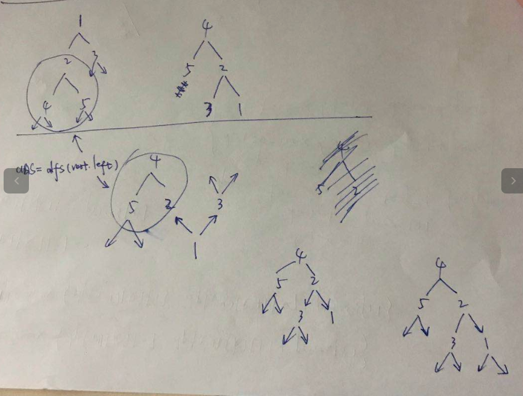

# 解题图示，二叉树翻转图示


# 代码
```python3
# Definition for a binary tree node.
# class TreeNode:
#     def __init__(self, x):
#         self.val = x
#         self.left = None
#         self.right = None

class Solution:
    def upsideDownBinaryTree(self, root: TreeNode) -> TreeNode:
        # base case: 如果一直左子树递归，则返回第一个左子树叶子节点
        if not root or not root.left: return root
        # 先完成左子树翻转，即左子树全体翻转到root节点之上
        new_root = self.upsideDownBinaryTree(root.left)
        # 可看做，root节点从最底层向上指向root.left和root.right
        # ， 此时，对root.left做更新，root.left的左子树为root.right
        # , root.right为root，但此时root的左右子树需重新设置为None
        root.left.left = root.right
        root.left.right = root
        root.left = root.right = None
        return new_root
```
