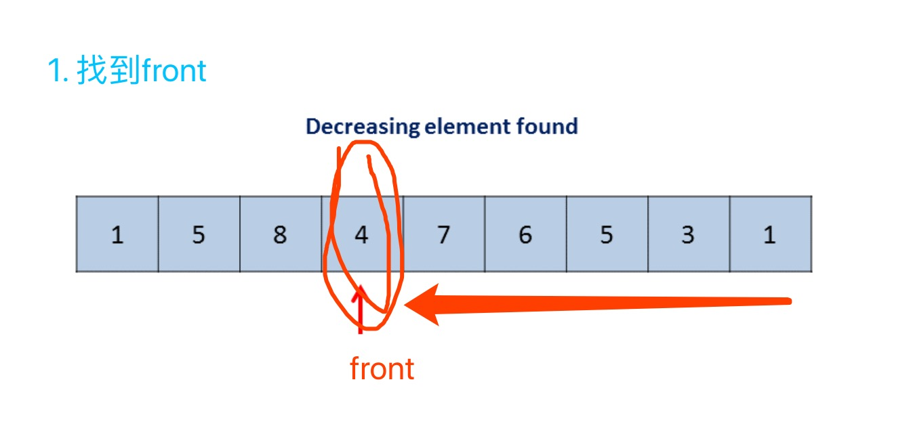
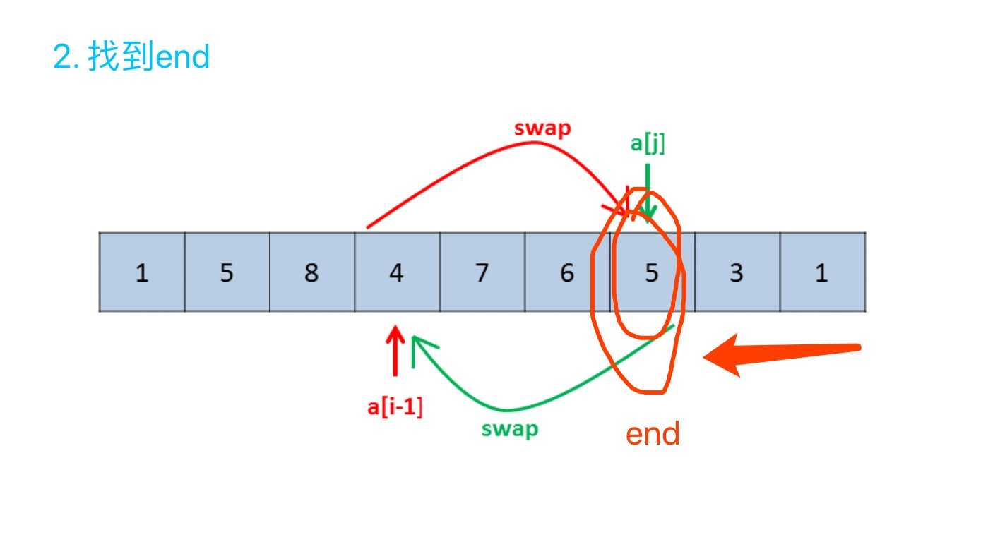
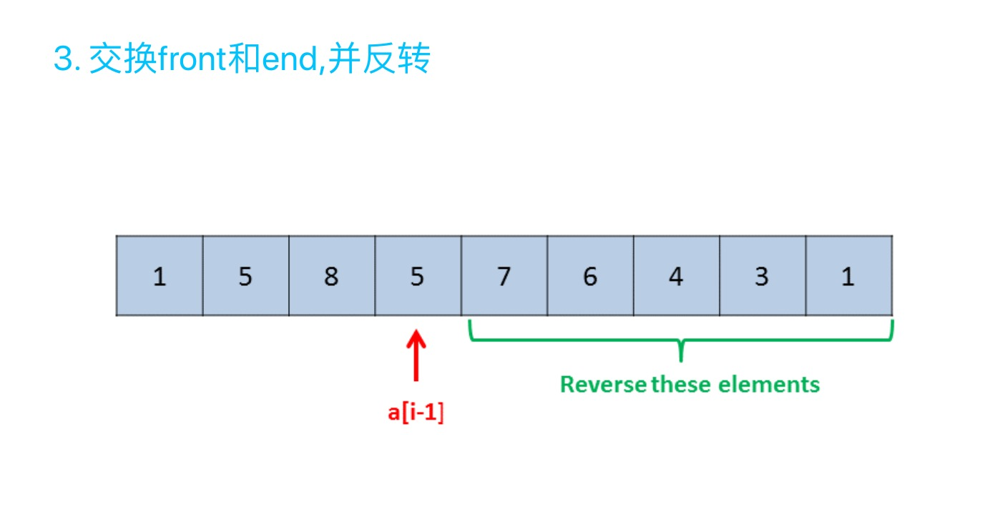

# **这类排列问题一般是三类：**
* 全排列
* 下一个排列
* 第k个排列

这里着重关注 **下一个排列** 和 **第k个排列**
## 下一个排列/更大的元素

- [31. 下一个排列](https://leetcode-cn.com/problems/next-permutation/)
> 实现获取下一个排列的函数，算法需要将给定数字序列重新排列成字典序中下一个更大的排列。    
> 如果不存在下一个更大的排列，则将数字重新排列成最小的排列（即升序排列）。     
>必须原地修改，只允许使用额外常数空间。    
>以下是一些例子，输入位于左侧列，其相应输出位于右侧列。    
1,2,3 → 1,3,2   
3,2,1 → 1,2,3     
1,1,5 → 1,5,1

解法：
```shell
1)front: 从数组尾部开始，找到不符合逆序排列的最开始的front；    
2)end: 从尾部开始，找到大于front，同时在front右边的end;    
3)reverse(front, end): 将front和end交换，并反转(front:]，即得到大于当前数的最小数  
```  




解法code:
```python3
class Solution:
    def nextPermutation(self, nums: List[int]) -> None:
        """
        Do not return anything, modify nums in-place instead.
        """
        if len(nums) == 1: return
        # 1.找到front
        front = len(nums) - 2
        while nums[front] >= nums[front + 1] and front >= 0:
            front -= 1
        # 2.找到end
        if front >= 0:
            end = len(nums) - 1
            while nums[end] <= nums[front] and end > front:
                end -= 1
            # 交换front和end
            nums[front], nums[end] = nums[end], nums[front]
        # 3.(front, end]反转，若已是最大排列，此反转则得到最小排列，符题意
        nums[front+1:] = nums[front+1:][::-1]
```

- [556. 下一个更大元素 III](https://leetcode-cn.com/problems/next-greater-element-iii/solution/xia-yi-ge-geng-da-yuan-su-iii-by-leetcode/)
> 给定一个32位正整数 n，你需要找到最小的32位整数，其与 n 中存在的位数完全相同，并且其值大于n。如果不存在这样的32位整数，则返回-1。
>
示例 1:
```shell
输入: 12
输出: 21
```
示例 2:
```shell
输入: 21
输出: -1
```
解法：
```python3
class Solution:
    def nextGreaterElement(self, n: int) -> int:
        nums = list(str(n))
        if len(nums) <= 1:
            return -1
        front = len(nums) - 2
        while front >= 0 and nums[front] >= nums[front + 1]:
            front -= 1
        if front >= 0:
            end = len(nums) - 1
            while front < end and nums[end] <= nums[front]:
                end -= 1
            nums[front], nums[end] = nums[end], nums[front]
        nums[front+1:] = nums[front+1:][::-1]
        n_new = int(''.join(nums))
        return n_new if n_new > n and n_new < pow(2, 31) else -1
```

## 第k个排列
- [60. 第k个排列](https://leetcode-cn.com/problems/permutation-sequence/)
- [386. 字典序排数](https://leetcode-cn.com/problems/lexicographical-numbers/)
- [440. 字典序的第K小数字](https://leetcode-cn.com/problems/k-th-smallest-in-lexicographical-order/)

解题思路： **回溯 + 剪枝**

- [60. 第k个排列](https://leetcode-cn.com/problems/permutation-sequence/)
> 给出集合 [1,2,3,…,n]，其所有元素共有 n! 种排列。      
按大小顺序列出所有排列情况，并一一标记，当 n = 3 时, 所有排列如下：
```
"123"
"132"
"213"
"231"
"312"
"321"
```
> 给定 `n` 和 `k`，返回第 `k` 个排列。

说明：
```
给定 n 的范围是 [1, 9]。
给定 k 的范围是[1,  n!]。
```
示例 1:
```
输入: n = 3, k = 3
输出: "213"
```

解法：(参考- [深度优先遍历 + 剪枝、双链表模拟](https://leetcode-cn.com/problems/permutation-sequence/solution/hui-su-jian-zhi-python-dai-ma-java-dai-ma-by-liwei/))

```python3
class Solution:
    def getPermutation(self, n: int, k: int) -> str:
        """
        比如在1234中找第 9 个数：‘2314’
        """
        def dfs(n, k, pre=[], depth=0):
            if depth == n:
                return ''.join(pre)
            # 以depth=0为例，此时以1为前缀的数有 (4-1)! 个
            ps = count(n - 1 - depth)
            for i in range(n):
                if not visited[i]:
                    # 3! < 9，说明肯定不是以1为前缀，从1后面的234中重新选
                    if ps < k:
                        # 去掉了以1为前缀的分支，那个分支共有 3! 个数
                        k -= ps
                        continue
                    # 是当前的2为前缀的分支, 加入结果集，当前层over
                    pre.append(str(i + 1))
                    visited[i] = True
                    # 下一层递归
                    return dfs(n, k, pre, depth + 1)
        # 尾递归求 n!
        def count(n, res=1):
            return res if n == 0 or n == 1 else count(n - 1, res * n)
        
        visited = [False for _ in range(n)]
        return dfs(n, k)
```
