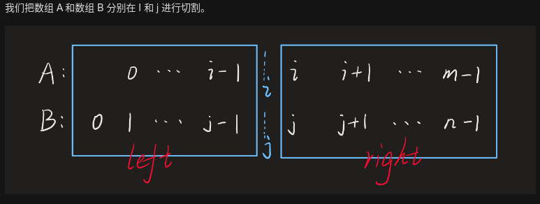
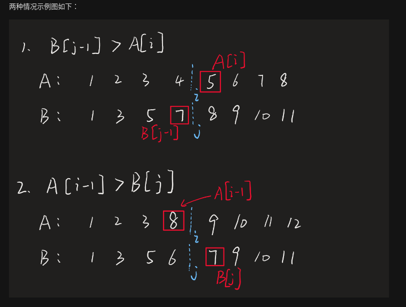

- 一点常识:

中位数计算公式:
```shell script
# n无论奇,偶
mid = (nums[n // 2] + nums[(n - 1) // 2]) / 2.0
```

# 例题
- [4. 寻找两个正序数组的中位数](https://leetcode-cn.com/problems/median-of-two-sorted-arrays/)
> 给定两个大小为 m 和 n 的正序（从小到大）数组 nums1 和 nums2。
请你找出这两个正序数组的中位数，并且要求算法的时间复杂度为 O(log(m + n))。

>你可以假设 nums1 和 nums2 不会同时为空。

<details>
    <summary>解题思路</summary>
    
参考:

[中位数的小技巧](https://leetcode-cn.com/problems/median-of-two-sorted-arrays/solution/shuang-zhi-zhen-by-powcai/)

[寻找两个有序数组的中位数 C#](https://leetcode-cn.com/problems/median-of-two-sorted-arrays/solution/leetcode-4-median-of-two-sorted-arrays-xun-zhao-li/)

这道题如果时间复杂度没有限定在 `O(log(m+n))`，
我们可以用 `O(log(min(m, n)))` 的算法解决，
用两个指针分别指向两个数组，比较指针下的元素大小，
一共移动次数为 `(m+n + 1)/2`，便是中位数。

如图:





```python
class Solution:
    def findMedianSortedArrays(self, nums1: List[int], nums2: List[int]) -> float:
        n1, n2 = len(nums1), len(nums2)
        if n1 > n2:
            return self.findMedianSortedArrays(nums2, nums1)
        k = (n1 + n2 + 1) // 2
        # 下标: 0 1 2 3 4 5 6 (7)
        # n1+n2为奇(7): k=4，在中位数3偏右
        # n1+n2为偶(8): k=4, 在中位数3,4,偏右
        # 综上，下标k是中位数下标偏右，这样就可以复用c1, 偶数的时候只需要计算出c2
        lo, hi = 0, n1
        while lo < hi:
            i = lo + ((hi - lo) >> 1)
            j = k - i
            if nums1[i] < nums2[j - 1]:
                lo = i + 1
            else:
                hi = i
        i, j = lo, k - lo
        c1 = max(nums1[i - 1] if i > 0 else float('-Inf'), nums2[j - 1] if j > 0 else float('-Inf'))
        if (n1 + n2) & 1:
            return c1
        c2 = min(nums1[i] if i < n1 else float('Inf'), nums2[j] if j < n2 else float('Inf'))
        return (c1 + c2) / 2.0
``` 
</details>

- [295. 数据流的中位数](https://leetcode-cn.com/problems/find-median-from-data-stream/)
> 设计一个支持以下两种操作的数据结构：

> `void addNum(int num)` - 从数据流中添加一个整数到数据结构中。

>`double findMedian()` - 返回目前所有元素的中位数。

<details>
    <summary>解题思路-双堆</summary>
    
```python
class MedianFinder:

    def __init__(self):
        """
        initialize your data structure here.
        """
        self.size = 0
        self.maxheap = []
        self.minheap = []
        

    def addNum(self, num: int) -> None:
        self.size += 1
        # 因为 (前半段长度 >= 后半段长度)， 所以add的元素优先补冲到后半段
        # 新add的元素，从前半段“游走”一遍后加入后半段，维护了数组递增
        _, max_top = heapq.heappushpop(self.maxheap, (-num, num))
        heapq.heappush(self.minheap, max_top)
        # 再来看整体长度，如果是奇数长度，则上面的操作使得 (前半段长度 < 后半段长度)
        # 需要从后半段匀出来一个，放到前半段
        if self.size & 1 == 1:
            min_top = heapq.heappop(self.minheap)
            heapq.heappush(self.maxheap, (-min_top, min_top))
        

    def findMedian(self) -> float:
        # 前半段大顶堆存的 tumple
        if self.size & 1 == 1:
            return self.maxheap[0][1]
        else:
            return (self.maxheap[0][1] + self.minheap[0]) / 2.0
``` 
</details>

- [480. 滑动窗口中位数](https://leetcode-cn.com/problems/sliding-window-median/)
> 给你一个数组 nums，有一个大小为 k 的窗口从最左端滑动到最右端。窗口中有 k 个数，每次窗口向右移动 1 位。你的任务是找出每次窗口移动后得到的新窗口中元素的中位数，并输出由它们组成的数组。

<details>
    <summary>解题思路</summary>
    
```python
class Solution:
    def medianSlidingWindow(self, nums: List[int], k: int) -> List[float]:
        lo, hi = 0, 0
        ans = []
        window = []
        # 套用 sliding window 模板
        while hi < len(nums):
            # 第一步，入窗就完事了
            bisect.insort_left(window, nums[hi])
            # 第二步，维护窗口，该出窗得出窗
            while len(window) > k:
                # 出窗
                window.pop(bisect.bisect_left(window, nums[lo]))
                # 窗口左端收缩
                lo += 1
            # 第三步，做该做的事
            if len(window) == k:
                # 注意这个求中位数的表达式，无论len(window)奇偶都如此
                ans.append((window[k // 2] + window[(k - 1) // 2]) / 2)
            # 最后，窗口右端始终右移，在路上
            hi += 1
        return ans
``` 
</details>
