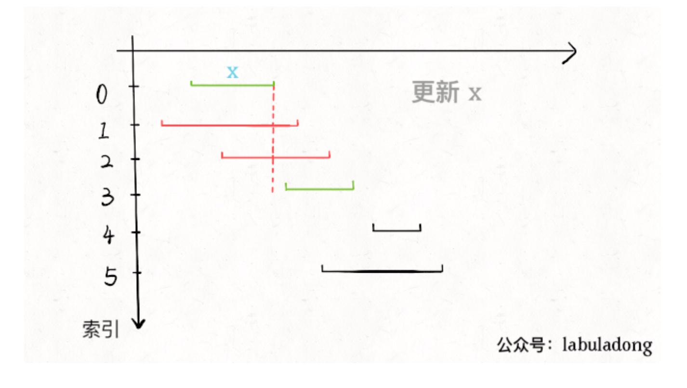

区间合并问题： 先排序，在合并计算
分为三类：
- 一般的区间合并
- 最大重复区间
- 最大不重复区间     

### 1. 一般的区间合并
- [56.合并区间](https://leetcode-cn.com/problems/merge-intervals/)       
**解法一:**      
a). 先排序,并设置空栈stack保存结果       
b). 比较 pre.end 和 cur.start：    
   如果：pre.end < cur.start: 则 stack.append(cur)       
   如果：pre.end >= cur.start: 则 stack[-1] = max(pre.end, cur.end)     
   
**解法二:**       
新插入的区间沿着原来的区间进行 cruise        
- [57. 插入区间](https://leetcode-cn.com/problems/insert-interval/)
> 给出一个无重叠的 ，按照区间起始端点排序的区间列表。        
在列表中插入一个新的区间，你需要确保列表中的区间仍然有序且不重叠（如果有必要的话，可以合并区间）。           
示例 1:
```
输入: intervals = [[1,3],[6,9]], newInterval = [2,5]
输出: [[1,5],[6,9]]
```
解法：
```python3
class Solution:
    # newInterval 沿着 intervals 进行 cruise
    def insert(self, intervals: List[List[int]], newInterval: List[int]) -> List[List[int]]:
        n = len(intervals)
        ans = []
        i = 0
        while i < n and intervals[i][1] < newInterval[0]:
            ans.append(intervals[i])
            i += 1
        tmp = [newInterval[0], newInterval[1]]
        while i < n and intervals[i][0] <= newInterval[1]:
            tmp[0] = min(tmp[0], intervals[i][0])
            tmp[1] = max(tmp[1], intervals[i][1])
            i += 1
        ans.append(tmp)
        while i < n:
            ans.append(intervals[i])
            i += 1
        return ans
```


### 2. 最大不重复区间     
- [435.无重叠区间](https://leetcode-cn.com/problems/non-overlapping-intervals/)    
- [452.用最少数量的箭引爆气球](https://leetcode-cn.com/problems/minimum-number-of-arrows-to-burst-balloons/)     

> intvs=[[1,3],[2,4],[3,6]]，这些区间最多有两个区间互不相交，即[[1,3],[3,6]]，你的算法应该返回 2
比如你今天有好几个活动，每个活动都可以用区间[start,end]表示开始和结束的时间，请问你今天最多能参加几个活动呢？

这类问题通用解决方法：（参考：[贪心算法之区间调度问题](https://mp.weixin.qq.com/s?__biz=MzAxODQxMDM0Mw==&mid=2247484493&idx=1&sn=1615b8a875b770f25875dab54b7f0f6f&chksm=9bd7fa45aca07353a347b7267aaab78b81502cf7eb60d0510ca9109d3b9c0a1d9dda10d99f50&mpshare=1&scene=1&srcid=&sharer_sharetime=1574251069965&sharer_shareid=166bdf842ef8f7b635591390fb76a3a9&pass_ticket=oN97es63kOTlboTfho28yfJ2eG6QmwGBGPGgKKuyA1EF6SESwW5e%2BcFEslZtoyva#rd)）     
a).从区间集合 intvs 中选择一个区间 x，这个 x 是在当前所有区间中结束最早的（end 最小);        
b).把所有与 x 区间相交的区间从区间集合 intvs 中删除;        
c).重复步骤 1 和 2，直到 intvs 为空为止。之前选出的那些 x 就是最大不相交子集。      


### 3. 最大重复区间
- [最少会议室问题II](https://leetcode-cn.com/problems/meeting-rooms-ii/)    
> 输入: [[0, 30],[5, 10],[15, 20]]    
> 输出: 2    
> 求用最少的会议室      

这类问题用**最小堆**解决：    
a).按照开始时间排序   
b).第一个会议M1结束时间M1.end加入堆heap中   
c).第二个会议M2开始时间M2.start：   
   如果 M1.end <= M2.start: M1.end = M2.end, 并对heap排序使最外面是最早结束的会议时间，即维持最小堆    
   如果 M1.end > M2.start: M2.end加入heap, 排序维持最小堆    
d).最终heap中的会议结束时间就是使用的最小会议室数    
