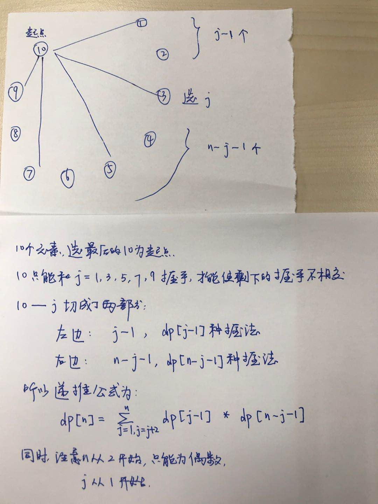

#### 卡特兰数讲解：
- [卡特兰数 — 计数的映射方法的伟大胜利](http://lanqi.org/skills/10939/)
- [卡特兰数详讲](https://blog.csdn.net/wookaikaiko/article/details/81105031)
#### 例题
- [1259. 不相交的握手](https://leetcode-cn.com/problems/handshakes-that-dont-cross/)
> 偶数 个人站成一个圆，总人数为 num_people 。每个人与除自己外的一个人握手，所以总共会有 num_people / 2 次握手。   
将握手的人之间连线，请你返回连线不会相交的握手方案数。   
由于结果可能会很大，请你返回答案 模 10^9+7 后的结果。



```python3
"""
从卡特兰数解法来看，不相交的握手即是不相交的圆内弦，圆内的2n个点按照n个+1和n个-1排列，连接相邻的+1和-1构成一个条弦。
当顺时针（或逆时针）选一个出发点（不在已有的2n个+1，-1之内选）出发，如果满足经历的+1，-1和不小于0，
即可使得上面相邻的+1，-1的连接构成n条不相交的弦
"""
class Solution:
    def numberOfWays(self, num_people: int) -> int:
        MOD = 10 ** 9 + 7
        dp = [0] * (num_people + 1)
        dp[0] = 1
        for n in range(2, num_people + 1, 2):
            # j可以取到n， 左边 j - 1, 右边 n - j - 1
            for j in range(1, n + 1, 2):
                dp[n] = (dp[n] + dp[j - 1] * dp[n - j - 1] % MOD) % MOD
        return dp[-1]
```

- [96. 不同的二叉搜索树](https://leetcode-cn.com/problems/unique-binary-search-trees/)
> 给定一个整数 n，求以 1 ... n 为节点组成的二叉搜索树有多少种？

<details>
    <summary> 展开 </summary>
    
```python
# 解法一：dp
class Solution:
    def numTrees(self, n: int) -> int:
        dp = [0] * (n + 1)
        dp[0] = 1
        for i in range(1, n + 1):
            # j可以取到i， 左边 j - 1, 右边 i - j
            for j in range(1, i + 1):
                dp[i] += dp[j - 1] * dp[i - j]
        return dp[-1]
        
# 解法二： 数学公式
class Solution:
    def numTrees(self, n: int) -> int:
        return int(math.factorial(2 * n) // math.factorial(n) // math.factorial(n + 1))
```

</details>
