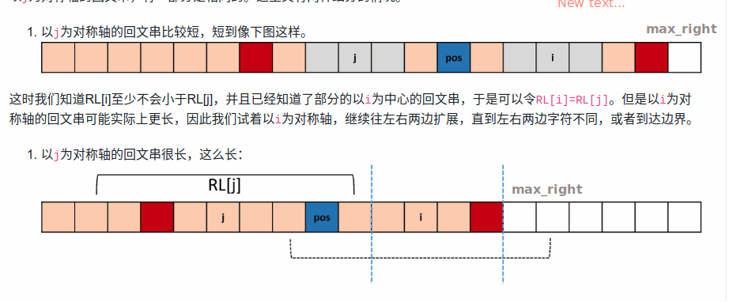

# 解法
回文系列的解法有两种:     
- manacher算法(马拉车)
- dp

## manacher算法


>　步骤：
- 预处理
- 如果`i`在`max_right`左边，　`rl[i] = min(rl[2 * pos - i], max_right - i)`;     
  如果在`max_right`右边，　`rl[i] = 1`     
- `rl[i]`向两边延伸
- 如果`rl[i] + i - 1`大于了当前最大右边界`max_rigth`，　则更新之
- 更新最大字符串长度

> 时间复杂度: O(n)   
> 空间复杂度: O(1)

```python
def manacher(s):
    s = '#' + '#'.join(s) + '#'
    rl = [0] * len(s)
    max_right = 0
    max_len = 0
    pos = 0
    for i, c in enumerate(s):
        if i < max_right:
            rl[i] = min(rl[2 * pos - i], max_right - i)
        else:
            rl[i] = 1
        while i - rl[i] >= 0 and i + rl[i] < len(s) and s[i - rl[i]] == s[i + rl[i]]:
            rl[i] += 1
        if i + rl[i] - 1 > max_right:
            max_right = i + rl[i] - 1
            pos = i
        max_len = max(max_len, rl[i])
    return max_len - 1
```

- [5.最长回文子串](https://leetcode-cn.com/problems/longest-palindromic-substring/)
> 给定一个字符串 s，找到 s 中最长的回文子串。你可以假设 s 的最大长度为 1000。

示例 1：
```shell
输入: "babad"
输出: "bab"
注意: "aba" 也是一个有效答案。
````

<details>
    <summary>manacher解法</summary>
    
```python
class Solution:
    def longestPalindrome(self, s: str) -> str:
        s = '#' + '#'.join(s) + '#'
        rl = [0] * len(s)
        pos = 0
        max_right, max_string = 0, ''
        for i, c in enumerate(s):
            if i < max_right:
                rl[i] = min(rl[2 * pos - i], max_right - i)
            else:
                rl[i] = 1
            while i - rl[i] >= 0 and i + rl[i] < len(s) and s[i - rl[i]] == s[i + rl[i]]:
                rl[i] += 1
            if i + rl[i] - 1 > max_right:
                max_right = i + rl[i] - 1
                pos = i
            max_string = max(max_string, s[i-rl[i]+1:i+rl[i]], key=len)
        return max_string.replace('#', '')
```
</details>

<details>
    <summary>dp解法-超时</summary>
    
```python
class Solution:
    def longestPalindrome(self, s: str) -> str:
        n = len(s)
        if n < 2:
            return s
        # dp[j][i]定义为s[j:i+1]中的回文串，　
        # s[j:i+1]不是回文串的话, dp[j][i] = ''
        dp = [['' for _ in range(n)] for _ in range(n)]
        ans = ''
        for i in range(n):
            dp[i][i] = s[i]
            for j in range(i - 1, -1, -1):
                if s[i] == s[j]:
                    if i - j < 3:
                        dp[j][i] = s[j:i+1]
                    elif dp[j + 1][i - 1]:
                        dp[j][i] = s[j] + dp[j + 1][i - 1] + s[i]
                ans = max(ans, dp[j][i], key=len)
        return ans or s[0]
```
</details>

## 动态规划
```python
def longestPalindrome(s):
    n = len(s)
    dp = [[0 for _ in range(n)] for _ in range(n)]
    max_len = 0
    for i in range(n):
        dp[i][i] = 1
        for j in range(i - 1, -1, -1):
            if s[j] == s[i]:
                if i - j < 2:
                    dp[j][i] = 2
                elif dp[j][i] > 0:
                    dp[j][i] = dp[j + 1][i - 1] + 2
            max_len = max(max_len, dp[j][i])
    return max_len
```
> 时间复杂度: O(n^2)       
> 空间复杂度: O(n^2)


- [516. 最长回文子序列](https://leetcode-cn.com/problems/longest-palindromic-subsequence/)
> 给定一个字符串 s ，找到其中最长的回文子序列，并返回该序列的长度。可以假设 s 的最大长度为 1000 。

<details>
    <summary>解法</summary>
    
```python
class Solution:
    def longestPalindromeSubseq(self, s: str) -> int:
        n = len(s)
        dp = [[0 for _ in range(n)] for _ in range(n)]
        for i in range(n):
            dp[i][i] = 1
            for j in range(i - 1, -1, -1):
                if s[i] == s[j]:
                    dp[j][i] = dp[j + 1][i - 1] + 2
                else:
                    dp[j][i] = max(dp[j + 1][i], dp[j][i - 1])
        return dp[0][n - 1]
```
</details>

# 例题汇总
- [647. 回文子串](https://leetcode-cn.com/problems/palindromic-substrings/)
> 给定一个字符串，你的任务是计算这个字符串中有多少个回文子串。        
具有不同开始位置或结束位置的子串，即使是由相同的字符组成，也会被视作不同的子串。
<details>
    <summary>解法</summary>
    
```python
class Solution:
    def countSubstrings(self, s: str) -> int:
        s = '#' + '#'.join(s) + '#'
        n = len(s)
        pos, max_right = 0, 0
        # rl记录以每个字符为对称轴的回文串的长度
        rl = [0 for _ in range(n)]
        # 马拉车算法求得rl
        for i in range(n):
            if i < max_right:
                rl[i] = min(rl[2*pos - i], max_right - i)
            else:
                rl[i] = 1
            while i - rl[i] >= 0 and i + rl[i] < n and s[i - rl[i]] == s[i + rl[i]]:
                rl[i] += 1
            if rl[i] + i - 1 > max_right:
                max_right = rl[i] + i - 1
                pos = i
        # 长度为x的回文串(算上#字符)), 子回文串个数为 x // 2
        return sum(x // 2 for x in rl)
```
</details>

- [131. 分割回文串](https://leetcode-cn.com/problems/palindrome-partitioning/)
> 给定一个字符串 s，将 s 分割成一些子串，使每个子串都是回文串。     
返回 s 所有可能的分割方案。

示例:
```shell
输入: "aab"
输出:
[
  ["aa","b"],
  ["a","a","b"]
]
```
<details>
    <summary>解法</summary>
    
```python
class Solution:
    def partition(self, s: str) -> List[List[str]]:
        ans = []

        def helper(s, tmp=[]):
            if not s:
                ans.append(tmp)
                return
            for i in range(1, len(s) + 1):
                if s[:i] == s[:i][::-1]:
                    helper(s[i:], tmp + [s[:i]])
        
        helper(s)
        return ans
```
</details>

- [132. 分割回文串 II](https://leetcode-cn.com/problems/palindrome-partitioning-ii/)
> 给定一个字符串 s，将 s 分割成一些子串，使每个子串都是回文串。     
返回符合要求的最少分割次数。

示例:
```shell script
输入: "aab"
输出: 1
解释: 进行一次分割就可将 s 分割成 ["aa","b"] 这样两个回文子串。
```
<details>
    <summary>解法</summary>
    
```python
class Solution:

    @functools.lru_cache(None)
    def minCut(self, s: str) -> int:
        if s == s[::-1]:
            return 0
        ans = float('Inf')
        for i in range(1, len(s) + 1):
            if s[:i] == s[:i][::-1]:
                ans = min(ans, self.minCut(s[i:]) + 1)
        return ans
```
</details>


### 其他类似
- [409. 最长回文串](https://leetcode-cn.com/problems/longest-palindrome/)
- [125. 验证回文串](https://leetcode-cn.com/problems/valid-palindrome/)
- [680. 验证回文字符串 Ⅱ](https://leetcode-cn.com/problems/valid-palindrome-ii/)
- [214. 最短回文串](https://leetcode-cn.com/problems/shortest-palindrome/)


