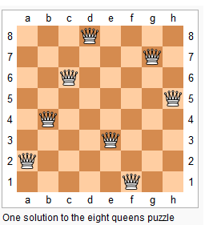

### 回溯的套路（格式）
- 标准格式
```python
def backtrack()
```

- 快捷格式
```python
def backtrack()
```

### 例题
 
 - [51. N 皇后](https://leetcode-cn.com/problems/n-queens/)
 > n 皇后问题研究的是如何将 n 个皇后放置在 n×n 的棋盘上，
>并且使皇后彼此之间不能相互攻击(同行、同列、同主对角线，同副对角线)



示例
```shell script
输入：4
输出：[
 [".Q..",  // 解法 1
  "...Q",
  "Q...",
  "..Q."],

 ["..Q.",  // 解法 2
  "Q...",
  "...Q",
  ".Q.."]
]
解释: 4 皇后问题存在两个不同的解法。
```

<details>
    <summary>解题思路</summary>
    
```python
class Solution:
    def solveNQueens(self, n: int) -> List[List[str]]:

        ans = []
        S = '.' * n

        def backtrack(r, pre, col, u_diag, d_diag):
            if r == n:
                ans.append(pre)
                return
            for c in range(n):
                """
                当前皇后有效的条件，不在这三种线上（按行扫描排列'Q', 故必然不在同一行）：
                1). 同一列
                2). 主对角线，坐标之和相等
                3). 副对角线，坐标之差相等
                """
                if c not in col and r + c not in u_diag and r - c not in d_diag:
                    backtrack(r + 1, pre + [S[:c] + "Q" + S[c+1:]], {c} | col, {r + c} | u_diag, {r - c} | d_diag)
        
        backtrack(0, [], set(), set(), set())
        return ans
```
</details>

- [52. N皇后 II](https://leetcode-cn.com/problems/n-queens-ii/)
> n 皇后问题研究的是如何将 n 个皇后放置在 n×n 的棋盘上，
>并且使皇后彼此之间不能相互攻击。给定一个整数 n，返回 n 皇后不同的解决方案的数量。

<details>
    <summary>解题思路</summary>
    
```python
class Solution:
    def totalNQueens(self, n: int) -> int:
        self.ans = 0
        def backtrack(r, col, u_diag, d_diag):
            if r == n:
                return True
            for c in range(n):
                """
                当前皇后有效的条件，不在这三种线上（按行扫描排列'Q', 故必然不在同一行）：
                1). 同一列
                2). 主对角线，坐标之和相等
                3). 副对角线，坐标之差相等
                """
                if c not in col and r + c not in u_diag and r - c not in d_diag:
                    if backtrack(r + 1, {c} | col, {r + c} | u_diag, {r - c} | d_diag):
                        self.ans += 1
            return False
        backtrack(0, set(), set(), set())
        return self.ans
```
</details>

- [36. 有效的数独](https://leetcode-cn.com/problems/valid-sudoku/)
> 判断一个 9x9 的数独是否有效。只需要根据以下规则，验证已经填入的数字是否有效即可。
>
>数字 1-9 在每一行只能出现一次。
数字 1-9 在每一列只能出现一次。
数字 1-9 在每一个以粗实线分隔的 3x3 宫内只能出现一次。

<details>
    <summary>解法一: 一次遍历</summary>
    
理论上空间复杂度最小, 只需要遍历 9 * 9, 检查每行, 每列, 每个3*3宫格是否重复.
```python
class Solution:
    def isValidSudoku(self, board: List[List[str]]) -> bool:
        def valid(r, c):
            for i in range(9):
                # 同行是否重复
                if i != c and board[r][i] == board[r][c]: return False
                # 同列是否重复
                if i != r and board[i][c] == board[r][c]: return False
                r1 = (r // 3) * 3 + i // 3
                c1 = (c // 3) * 3 + i % 3
                # 小9宫格是否重复
                if r1 != r and c1 != c and board[r1][c1] == board[r][c]:
                    return False
            return True
        
        for r in range(9):
            for c in range(9):
                # 只检查非空格子
                if board[r][c] != '.' and  not valid(r, c):
                    return False
        return True
``` 
</details>

<details>
    <summary>解法二: 空间换时间</summary>
    
记录当前的行,列,3*3宫格出现过的数字, 是一种空间换时间的做法
```python
class Solution:
    def isValidSudoku(self, board: List[List[str]]) -> bool:
        # 记录第i行 0-9 的数字各自是否之前出现
        rows = {i: [False] * 10 for i in range(9)}
        # 第j列
        cols = {j: [False] * 10 for j in range(9)}
        # 第 (i1, j1) 个box
        boxes = {(i, j):[False] * 10 for i in range(3) for j in range(3)}
        for i in range(9):
            for j in range(9):
                if board[i][j] != '.':
                    num = int(board[i][j])
                    # 第i行, 或第j列, 或小的3*3宫格 重复
                    if rows[i][num] or cols[j][num] or boxes[(i // 3, j // 3)][num]:
                        return False
                    # 此时第i行, 第j列, 第(i1, j1)宫格都出现了数字num, 这三个域都要记录
                    rows[i][num] = cols[j][num] = boxes[(i // 3, j // 3)][num] = True
        return True
``` 
</details>

- [37. 解数独](https://leetcode-cn.com/problems/sudoku-solver/)


<details>
    <summary>解题思路</summary>
    
```python

``` 
</details>