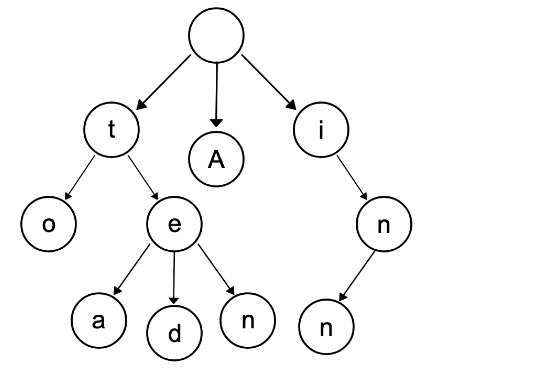
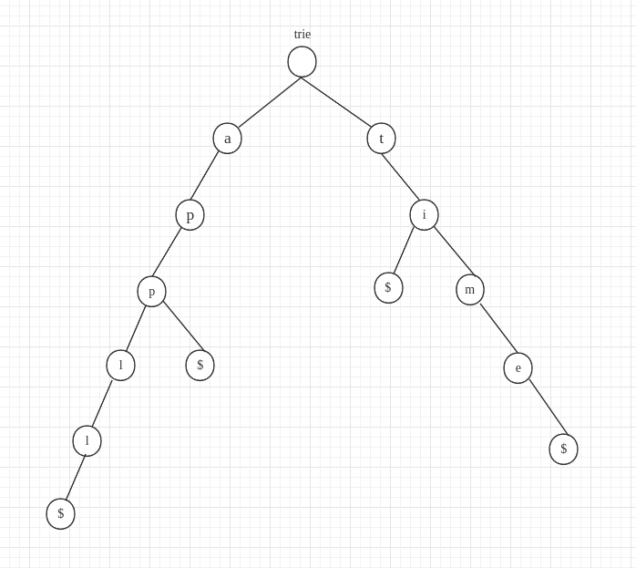

# 定义
[参考- Trie 吐血攻略，包教包会](https://leetcode-cn.com/problems/short-encoding-of-words/solution/99-java-trie-tu-xie-gong-lue-bao-jiao-bao-hui-by-s/)
> 字典树又名前缀树，Trie树，是一种存储大量字符串的树形数据结构，相比于HashMap存储，在存储单词（和语种无关，任意语言都可以）的场景上，节省了大量的内存空间。      
下图演示了一个保存了8个单词的字典树的结构，8个单词分别是：`A`, `to`, `tea`, `ted, `ten, `i, `in, `inn`。




从根节点走到叶子节点，尝试走一下所有的路径.
**每条从根节点到叶子节点的路径都构成了单词
（有的不需要走到叶子节点也是单词，比如 `i` 和 `in`）**。
trie树里的每个节点只需要保存当前的字符就可以了
（当然你也可以额外记录别的信息，比如记录一下如果以当前节点结束是否构成单词）。

从根节点出发的路径，都是给定单词列表里某个/某些单词的前缀。
反之，如果某个字符串没有出现在这棵树的路径上，那就肯定不是某个单词的前缀。
上面说很明显这题是用字典树来做，原因就是：**这类很明显是用字典树去做的题目，
明显特征就是需要大量地判断某个字符串是否是给定单词列表中的前缀/后缀。** 
为什么要说后缀也可以呢？因为把单词倒着插入，就可以搜后缀了~

trie节点的定义(trie的根节点定义为一个空节点):
```python
class TrieNode:
    
    def __init__(self):
        self.children = dict()
```

插入单词的操作:
```python
def insert(word):
    cur = root
    for w in word:
        if w not in cur:
            cur[w] = TrieNode()
        cur = cur[w]
```

- [820. 单词的压缩编码](https://leetcode-cn.com/problems/short-encoding-of-words/)
> 给定一个单词列表，我们将这个列表编码成一个索引字符串 S 与一个索引列表 A。   
例如，如果这个列表是 ["time", "me", "bell"]，我们就可以将其表示为 S = "time#bell#" 和 indexes = [0, 2, 5]。      
对于每一个索引，我们可以通过从字符串 S 中索引的位置开始读取字符串，直到 "#" 结束，来恢复我们之前的单词列表。      
那么成功对给定单词列表进行编码的最小字符串长度是多少呢？      

示例：
```
输入: words = ["time", "me", "bell"]
输出: 10
说明: S = "time#bell#" ， indexes = [0, 2, 5] 。
```
<details>
    <summary>字典树-list版</summary>
    
```python3
class Solution:
    def minimumLengthEncoding(self, words: List[str]) -> int:
        trie = Trie()
        # 1. 先插入长的单词,比如time,这样碰到me就不用在插入了
        # 2. 根据题意, 需要是后缀搜索,故需要单词反着插入
        #    比如time, me则后缀都是me,反着插入即是em前缀
        return sum(trie.insert(word) for word in sorted(words, key=len, reverse=True))
        

class Trie:
    
    def __init__(self):
        self.root = TrieNode()
    
    def insert(self, word):
        is_new = False
        cur = self.root
        for i in range(len(word) - 1, -1, -1):
            idx = ord(word[i]) - ord('a')
            if cur.children[idx] is None:
                is_new = True
                cur.children[idx] = TrieNode()
            cur = cur.children[idx]
        return len(word) + 1 if is_new else 0


class TrieNode:
    
    def __init__(self):
        self.children = [None for _ in range(26)]
```
</details>

<details>
    <summary>字典树-dict版</summary>
    
```python3
class Solution:
    def minimumLengthEncoding(self, words: List[str]) -> int:
        trie = Trie()
        #words = list(set(words))
        return sum(trie.insert(word) for word in sorted(words, key=len, reverse=True))


class Trie:
    
    def __init__(self):
        self.root = TrieNode()
    
    def insert(self, word):
        is_new = False
        cur = self.root
        for w in word[::-1]:
            if w not in cur.children:
                is_new = True
                cur.children[w] = TrieNode()
            cur = cur.children[w]
        return len(word) + 1 if is_new else 0


class TrieNode:
    
    def __init__(self, val=None):
        self.children = dict()
```
</details>

<details>
    <summary>字典树-pythonic版</summary>
    
[参考- 单词的压缩编码](https://leetcode-cn.com/problems/short-encoding-of-words/solution/dan-ci-de-ya-suo-bian-ma-by-leetcode-solution/314321)
```python3
class Solution:
    def minimumLengthEncoding(self, words: List[str]) -> int:
        words = list(set(words)) #remove duplicates
        #Trie is a nested dictionary with nodes created
        # when fetched entries are missing
        Trie = lambda: collections.defaultdict(Trie)
        trie = Trie()

        #reduce(..., S, trie) is trie[S[0]][S[1]][S[2]][...][S[S.length - 1]]
        nodes = [reduce(dict.__getitem__, word[::-1], trie)
                 for word in words]

        #Add word to the answer if it's node has no neighbors
        return sum(len(word) + 1
                   for i, word in enumerate(words)
                   if len(nodes[i]) == 0)

```
</details>

- [208. 实现 Trie (前缀树)](https://leetcode-cn.com/problems/implement-trie-prefix-tree/)
> 实现一个 Trie (前缀树)，包含 insert, search, 和 startsWith 这三个操作。

示例:
```shell script
Trie trie = new Trie();

trie.insert("apple");
trie.search("apple");   // 返回 true
trie.search("app");     // 返回 false
trie.startsWith("app"); // 返回 true
trie.insert("app");   
trie.search("app");     // 返回 true
```

<details>
    <summary>解题思路</summary>
    
```python3
class Trie:

    def __init__(self):
        """
        Initialize your data structure here.
        """
        self.lookup = {}


    def insert(self, word: str) -> None:
        """
        Inserts a word into the trie.
        """
        trie = self.lookup
        for w in word:
            if w not in trie:
                trie[w] = {}
            trie = trie[w]
        """
        必须以标志字符结尾,不能靠{}为空来判断
        因为,存在重叠情况apple, app, app的结尾不为空,但是app可能存在也可能不存在
        """
        trie['$'] = '$'

    def search(self, word: str) -> bool:
        """
        Returns if the word is in the trie.
        """
        trie = self.lookup
        for w in word:
            if w not in trie:
                return False
            trie = trie[w]
        return '$' in trie


    def startsWith(self, prefix: str) -> bool:
        """
        Returns if there is any word in the trie that starts with the given prefix.
        """
        trie = self.lookup
        for w in prefix:
            if w not in trie:
                return False
            trie = trie[w]
        return True
```
</details>

- [720. 词典中最长的单词](https://leetcode-cn.com/problems/longest-word-in-dictionary/)
> 给出一个字符串数组`words`组成的一本英语词典。从中找出最长的一个单词，该单词是由`words`词典中其他单词逐步添加一个字母组成。
若其中有多个可行的答案，则返回答案中字典序最小的单词。       
若无答案，则返回空字符串。

示例 1：
```
输入：
words = ["w","wo","wor","worl", "world"]
输出："world"
解释： 
单词"world"可由"w", "wo", "wor", 和 "worl"添加一个字母组成。
```
<details>
    <summary>解题思路</summary>
    
```python
class Solution:
    def longestWord(self, words: List[str]) -> str:
        trie = Trie()
        # 第一遍,先建立字典树trie
        for word in words:
            trie.insert(word)
        ans = ''
        # 第二遍, 从最长的单词搜索
        for word in sorted(words, key=len, reverse=True):
            if trie.search(word):
                # 当搜索的单词比已有的单词还短,退出搜索(之后搜索出来的必然不会大于已有的单词长度)
                if len(word) < len(ans): 
                    break
                elif len(word) > len(ans):
                    ans = word
                else:
                    # 取字典序最小者
                    ans = min(ans, word)
        return ans

class TrieNode:

    def __init__(self):
        self.children = collections.defaultdict(TrieNode)
        self.end = False


class Trie:

    def __init__(self):
        self.root = TrieNode()
    
    def insert(self, word):
        node = self.root
        for c in word:
            node = node.children[c]
        # 在每一个单词结尾标记end
        node.end = True

    def search(self, word):
        node = self.root
        for c in word:
            node = node.children.get(c)
            # 在遍历word的过程中,一旦中间某个字符不是结尾字符,即认为不能形成连续的word
            if node is None or not node.end:
                return False
        return True
```
</details>

# 模板
### 模板一  字符串`text`中的每个字符开头且存在于字典`dictionary`中的字符的结尾索引
> text = "mississippi", dictionary = ["is","ppi","hi","sis","i","ssippi"]
>, 找到以`m`开头的所以在`dictionary`的字符在`text`中的结尾索引，
>以`i`开头，以`s`开头，...

<details>
    <summary>模板</summary>
    
```python
class Solution:
    def multiSearch(self, big: str, dictionary):
        trie = Trie()
        #　将所有较短字符插入到字典树中, 即构建字典树
        for word in dictionary:
            trie.insert(word)
        # start存储字符串text[i:j+1]在text中的起始索引
        start = collections.defaultdict(list)
        for i in range(len(text)):
            # trie.search()返回所有存在于dictionary且以i开头的字符串的结尾索引j
            for j in trie.search(text, i):
                start[text[i:j+1]].append(i)
        #　通过start，找到dictionary中每个对应较短字符串的索引起始索引，即start和small两者的关系转换
        return [start[small] for small in dictionary]


# 1. 定义字典树节点
class TrieNode:
    def __init__(self):
        self.children = collections.defaultdict(TrieNode)
        self.isword = False


# 2. 定义字典树
class Trie:
    def __init__(self):
        self.root = TrieNode()
    
    # ３. 构建字典树，插入单词
    def insert(self, word):
        node = self.root
        for c in word:
            # 3.1
            node = node.children[c]
        # 一个完整的较短字符串结束标志
        node.isword = True
    
    # ４. 按需要搜索
    def search(self, text, first):
        # 通过构建的字典树，在text中找到所有以text[first]开头的较短字符串的结尾字符的索引
        end = []
        node = self.root
        for idx in range(first, len(text)):
            node = node.children.get(text[idx])
            #　4.1 中间的字符不在first开头的较短字符串中，后面字符更不会在，故直接返回
            if not node:
                return end
            #　4.2 找到一个完整的较短字符，将其结尾字符在text中的索引加入end中
            if node.isword:
                end.append(idx)
        return end
```

结合 **BFS** 搜索剩下的以给定子字符串为前缀的所有字符串:
```python
def sum(self, prefix: str) -> int:
        node = self.root
        for c in prefix:
            node = node.children.get(c)
            # 一个前缀没搜索完，即给定的前缀prefix不存在以创建的字典树中
            if node is None:
                return 0
        # 给定的前缀prefix存在于字典树中，则继续运用bfs搜索所有带有该前缀的key，计算总和
        ans = 0
        deque = collections.deque([node])
        while deque:
            node = deque.popleft()
            if node.iskey:
                # 当前是一个完整的key，将起val计入总和
                ans += node.value
            # 继续搜索下一层的key，直到没有层了(children)
            for nxt_node in node.children.values():
                deque.append(nxt_node)
        return ans
```
</details>

-> **模板相关题目：**
- [面试题 17.17. 多次搜索](https://leetcode-cn.com/problems/multi-search-lcci/)
- [1065. 字符串的索引对](https://leetcode-cn.com/problems/index-pairs-of-a-string/)
- [面试题 17.13. 恢复空格-sweetiee解法二](https://leetcode-cn.com/problems/re-space-lcci/solution/jian-dan-dp-trieshu-bi-xu-miao-dong-by-sweetiee/)


##### 其他字典树题目:
- [127. 单词接龙](https://leetcode-cn.com/problems/word-ladder/)
- [126. 单词接龙 II](https://leetcode-cn.com/problems/word-ladder-ii/)
- [79. 单词搜索](https://leetcode-cn.com/problems/word-search/)
- [212. 单词搜索 II](https://leetcode-cn.com/problems/word-search-ii/)
- [面试题 17.22. 单词转换](https://leetcode-cn.com/problems/word-transformer-lcci/)
- [面试题 17.13. 恢复空格](https://leetcode-cn.com/problems/re-space-lcci/)
- [leetcode-trie集合](https://leetcode-cn.com/tag/trie/)
