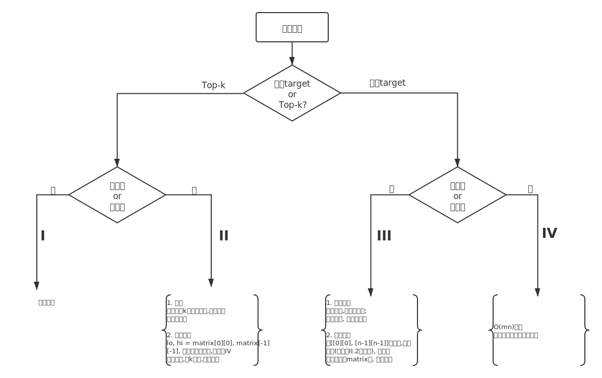

# 多路有序合并/查找－堆排序
**特点:**　
- 多平行的链表合并
- 多行有序数组找到其中第k个元素

**例题**
- [23. 合并K个排序链表](https://leetcode-cn.com/problems/merge-k-sorted-lists/)
> 合并 `k` 个排序链表，返回合并后的排序链表。请分析和描述算法的复杂度。

示例:
```
输入:
[
  1->4->5,
  1->3->4,
  2->6
]
输出: 1->1->2->3->4->4->5->6
```

<details>
    <summary>解法</summary>
    
```python
# 方法一：　每次合并两个链表，转化为合并两个链表(略)

# 方法二：　堆排序
class Solution:
    def mergeKLists(self, lists: List[ListNode]) -> ListNode:
        hp = []
        # 每条链表头入堆，堆中存储每条链表平行移动的头部指针
        for i in range(len(lists)):
            if lists[i]:
                heapq.heappush(hp, (lists[i].val, i))
                lists[i] = lists[i].next
        
        dummy = ListNode(-1)
        node = dummy
        while hp:
            val, i = heapq.heappop(hp)
            node.next = ListNode(val)
            # 该条链表指针后移，下一个节点入堆
            if lists[i]:
                heapq.heappush(hp, (lists[i].val, i))
                lists[i] = lists[i].next
            node = node.next
        return dummy.next
```
</details>


- [378. 有序矩阵中第K小的元素](https://leetcode-cn.com/problems/kth-smallest-element-in-a-sorted-matrix/)
> 给定一个 `n x n` 矩阵，其中每行和每列元素均按升序排序，找到矩阵中第 `k` 小的元素。     
请注意，它是排序后的第 `k` 小元素，而不是第 `k` 个不同的元素。

示例：
```
matrix = [
   [ 1,  5,  9],
   [10, 11, 13],
   [12, 13, 15]
],
k = 8,

返回 13。
```

<details>
    <summary>方法一：　堆排序, O(klogn)</summary>
    
```python
class Solution:
    def kthSmallest(self, matrix: List[List[int]], k: int) -> int:
        hp = []
        n = len(matrix)
        for i in range(min(k, n)):
            heapq.heappush(hp, (matrix[i][0], i, 0))
        val, i, j = 0, 0, 0
        while k > 0:
            val, i, j = heapq.heappop(hp)
            if j + 1 < n:
                heapq.heappush(hp, (matrix[i][j + 1], i, j + 1))
            k -= 1
        return val
```
</details>

<details>
    <summary>方法二：　二分（非常规/二分变体), O(m+n)*log(matrix[-1][-1]-matrix[0][0])</summary>
    
```python
class Solution:
    def kthSmallest(self, matrix: List[List[int]], k: int) -> int:
        def rank(num):
            r, c = 0, cols - 1
            cnt = 0
            while r < rows and 0 <= c:
                if matrix[r][c] <= num:
                    cnt += c + 1
                    r += 1
                else:
                    c -= 1
            return cnt
        rows, cols = len(matrix), len(matrix[0])
        low, hight = matrix[0][0], matrix[-1][-1]
        while low < hight:
            mid = low + ((hight - low) >> 1)
            rk = rank(mid)
            if rk < k:
                low = mid + 1
            else:
                hight = mid
        return low
```
</details>


# 搜索矩阵
该矩阵有三种形式:
### I. 严格递增
**每一行最后一个元素小于下一行第一个元素**, 两种解法:
- O(logmn)的解法：以 matrix[0][0] - matrix[-1][-1]　范围的元素作为区间[0, m * n - 1]，　运用二分查找
- O(logm) + O(logn)的解法：先行二分，　再列二分;

这里以为第二种解法为例
**例题**
- [74. 搜索二维矩阵](https://leetcode-cn.com/problems/search-a-2d-matrix/)
```shell
编写一个高效的算法来判断 m x n 矩阵中，是否存在一个目标值。该矩阵具有如下特性：

每行中的整数从左到右按升序排列。
每行的第一个整数大于前一行的最后一个整数。
示例 1:

输入:
matrix = [
  [1,   3,  5,  7],
  [10, 11, 16, 20],
  [23, 30, 34, 50]
]
target = 3
输出: true
```

<details>
    <summary>解法</summary>
    
```python
class Solution:
    def searchMatrix(self, matrix: List[List[int]], target: int) -> bool:
        # 二分查找找到<=target的元素的索引
        def binarySearch(arr, target):
            lo, hi = 0, len(arr) - 1
            while lo < hi:
                mid = lo + ((hi - lo) >> 1)
                if arr[mid] == target:
                    return mid
                elif arr[mid] < target:
                    lo = mid + 1
                else:
                    hi = mid
            return hi
        
        if not matrix or not matrix[0]:
            return False
        if target < matrix[0][0] or target > matrix[-1][-1]:
            return False
        # import numpy as np
        # matrix = np.array(matrix)
        
        # 纵坐标二分：　找到target可能位于的行
        col_idx = binarySearch([x[-1] for x in matrix], target)
        # 横坐标二分：　找到target可能位于的列
        row_idx = binarySearch(matrix[col_idx], target)
        return True if matrix[col_idx][row_idx] == target else False
```
</details>


### II. 递增－每行递增，每列递增;
**思想:** 从 **右上角** 或者 **左下角** 出发，**横竖搜索**
- [240. 搜索二维矩阵 II](https://leetcode-cn.com/problems/search-a-2d-matrix-ii/)
```shell
编写一个高效的算法来搜索 m x n 矩阵 matrix 中的一个目标值 target。该矩阵具有以下特性：

每行的元素从左到右升序排列。
每列的元素从上到下升序排列。
示例:

现有矩阵 matrix 如下：

[
  [1,   4,  7, 11, 15],
  [2,   5,  8, 12, 19],
  [3,   6,  9, 16, 22],
  [10, 13, 14, 17, 24],
  [18, 21, 23, 26, 30]
]
```

<details>
    <summary>解法</summary>
    
```python
class Solution:
    def searchMatrix(self, matrix, target):
        """
        :type matrix: List[List[int]]
        :type target: int
        :rtype: bool
        """
        if not matrix or not matrix[0]: return False
        rows, cols = len(matrix), len(matrix[0])
        r, c = 0, cols - 1
        while r < rows and 0 <= c:
            if matrix[r][c] == target: 
                return True
            elif matrix[r][c] < target:
                r += 1
            else:
                c -= 1
        return False
```
</details>

### III. 稀疏递增－每行递增(较少)

## 其他类似题目:

