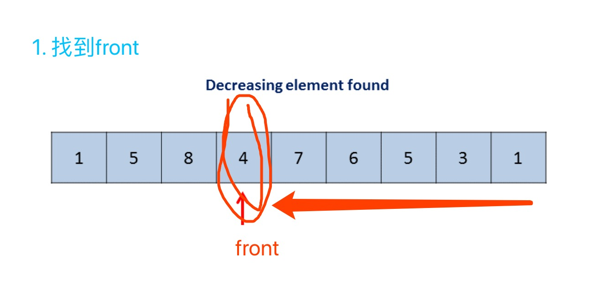
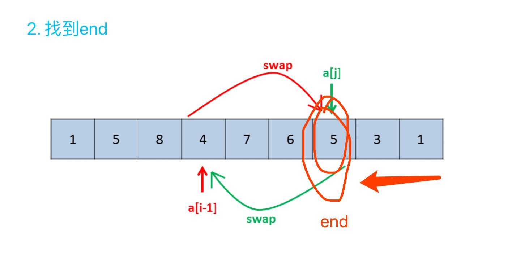
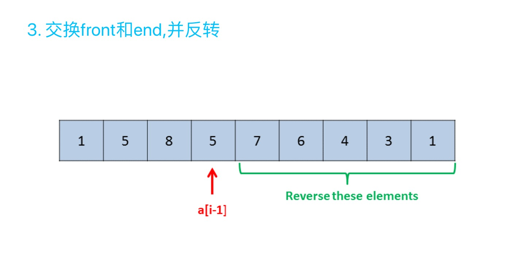

- [31. 下一个排列](https://leetcode-cn.com/problems/next-permutation/)
> 实现获取下一个排列的函数，算法需要将给定数字序列重新排列成字典序中下一个更大的排列。
>如果不存在下一个更大的排列，则将数字重新排列成最小的排列（即升序排列）。
>必须原地修改，只允许使用额外常数空间。
>以下是一些例子，输入位于左侧列，其相应输出位于右侧列。
```shell
1,2,3 → 1,3,2
3,2,1 → 1,2,3
1,1,5 → 1,5,1
```
解法：
>1)front: 从数组尾部开始，找到不符合逆序排列的最开始的front；    
>2)end: 从尾部开始，找到大于front，同时在front右边的end;    
>3)reverse(front, end): 将front和end交换，并反转(front, end]，即得到大于当前数的最小数    




解法code:
```python3
class Solution:
    def nextPermutation(self, nums: List[int]) -> None:
        """
        Do not return anything, modify nums in-place instead.
        """
        if len(nums) == 1: return
        # 1.找到front
        front = len(nums) - 2
        while nums[front] >= nums[front + 1] and front >= 0:
            front -= 1
        # 2.找到end
        if front >= 0:
            end = len(nums) - 1
            while nums[end] <= nums[front] and end > front:
                end -= 1
            # 交换front和end
            nums[front], nums[end] = nums[end], nums[front]
        # 3.(front, end]反转，若已是最大排列，此反转则得到最小排列，符题意
        nums[front+1:] = nums[front+1:][::-1]
```

- [556. 下一个更大元素 III](https://leetcode-cn.com/problems/next-greater-element-iii/solution/xia-yi-ge-geng-da-yuan-su-iii-by-leetcode/)
> 给定一个32位正整数 n，你需要找到最小的32位整数，其与 n 中存在的位数完全相同，并且其值大于n。如果不存在这样的32位整数，则返回-1。
>
示例 1:
```shell
输入: 12
输出: 21
```
示例 2:
```shell
输入: 21
输出: -1
```
解法：
```python3

```
