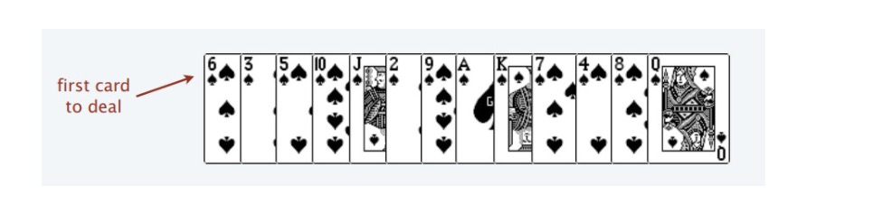
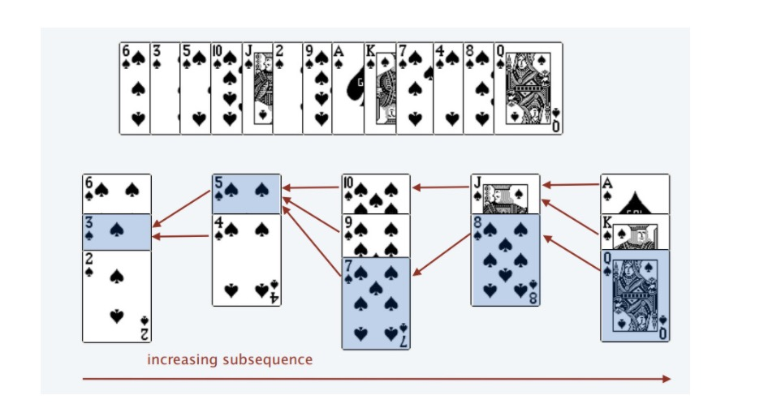

# I. 思路
两种解法：**dp** + **二分查找法**

### a). dp

参考： [labuladong-动态规划设计方法&&纸牌游戏讲解二分解法](https://leetcode-cn.com/problems/longest-increasing-subsequence/solution/dong-tai-gui-hua-she-ji-fang-fa-zhi-pai-you-xi-jia/)

`dp[i]` 表示最后一个元素是`nums[i]`的上升子序列, 则`dp[i]`需要比较`i`之前所有的元素和`nums[i]`的大小，在小于`nums[i]`的基础上加`1`：

```python3
for j in range(i):
  if nums[i] > nums[j]:
    dp[i] = max(dp[i], dp[j] + 1)
```

遍历所有的`nums`，则得到每一个`i`:

```python3
for i in range(1, n):
  for j in range(i):
      if nums[j] < nums[i]:
          dp[i] = max(dp[i], dp[j] + 1)
```

返回`max(dp)`即为所求

### b). 二分法：
 
将nums看作一个一排纸牌：



我们像遍历数组那样从左到右一张一张处理这些扑克牌，最终要把这些牌分成若干堆。

只能把点数小的牌压到点数比它大的牌上。如果当前牌点数较大没有可以放置的堆，则新建一个堆，把这张牌放进去。
如果当前牌有多个堆可供选择，则选择最左边的堆放置。

比如说上述的扑克牌最终会被分成这样 5 堆（我们认为 A 的值是最大的，而不是 1），
且遇到多个可选择堆的时候要放到最左边的堆上呢？因为这样可以保证牌堆顶的牌有序（2, 4, 7, 8, Q）.



我们只要把处理扑克牌的过程编程写出来即可。每次处理一张扑克牌不是要找一个合适的牌堆顶来放吗，牌堆顶的牌不是有序吗，
这就能用到二分查找了：用二分查找来搜索当前牌应放置的位置。最终**纸牌的堆数 = 最长上升子序列**。

# II. 代码

- [300. 最长上升子序列](https://leetcode-cn.com/problems/longest-increasing-subsequence/)
> 给定一个无序的整数数组，找到其中最长上升子序列的长度。

示例:
```shell
输入: [10,9,2,5,3,7,101,18]
输出: 4 
解释: 最长的上升子序列是 [2,3,7,101]，它的长度是 4。
```
<details>
    <summary>解法</summary>
    
```python3
# 1). dp
class Solution:
    def lengthOfLIS(self, nums: List[int]) -> int:
        if not nums: return 0
        n = len(nums)
        dp = [1 for _ in range(n)]    # dp[i]表示：上升子序列最后一个元素为i时的长度
        for i in range(1, n):
            for j in range(i):        # 求得每一个dp[i]
                if nums[j] < nums[i]:
                    dp[i] = max(dp[i], dp[j] + 1)   # 加上dp[i]本身长度1
        return max(dp)
        
# 2). 二分法
class Solution:
    def lengthOfLIS(self, nums: List[int]) -> int:
        if not nums: return 0
        top = [0 for _ in range(len(nums))]
        piles = 0                 # piles堆数 = 最长上升子序列的长度
        for num in nums:
            idx = bisect.bisect_left(top, num, 0, piles)
            top[idx] = num        # 无论是新建队还是续接已有的堆，都是 top[idx]=num
            if idx == piles:      # 此时表示纸牌需要插入到最后一个堆，即新建堆
                piles += 1
        return piles
```
</details>

下面这道**堆箱子**的**三维**`最长上升子序列问题`，只能用`dp`解决，无法通过`二分法`解答.

- [面试题 08.13. 堆箱子](https://leetcode-cn.com/problems/pile-box-lcci/)
> 堆箱子。给你一堆n个箱子，箱子宽 wi、深 di、高 hi。箱子不能翻转，将箱子堆起来时，下面箱子的宽度、高度和深度必须大于上面的箱子。实现一种方法，搭出最高的一堆箱子。箱堆的高度为每个箱子高度的总和。输入使用数组[wi, di, hi]表示每个箱子。

示例1:
```
 输入：box = [[1, 1, 1], [2, 2, 2], [3, 3, 3]]
 输出：6
```

<details>
    <summary>解法</summary>
    
```python
class Solution:
    def pileBox(self, box: List[List[int]]) -> int:
        # wi上升序，相同的wi，di按照降序排列
        box.sort(key=lambda x: (x[0], -x[1]))
        dp = [0 for _ in range(len(box))]
        for i in range(len(box)):
            dp[i] = box[i][2]
            for j in range(i):
                # wi上已经排序了，无需再比较box[i][0]
                if box[j][1] < box[i][1] and box[j][2] < box[i][2]:
                    dp[i] = max(dp[i], dp[j] + box[i][2])
        return max(dp)
```

</details>

- [354. 俄罗斯套娃信封问题](https://leetcode-cn.com/problems/russian-doll-envelopes/)
> 给定一些标记了宽度和高度的信封，宽度和高度以整数对形式 (w, h) 出现。当另一个信封的宽度和高度都比这个信封大的时候，
这个信封就可以放进另一个信封里，如同俄罗斯套娃一样。        
请计算最多能有多少个信封能组成一组“俄罗斯套娃”信封（即可以把一个信封放到另一个信封里面）。        
说明:       
不允许旋转信封。

示例:
```shell
输入: envelopes = [[5,4],[6,4],[6,7],[2,3]]
输出: 3 
解释: 最多信封的个数为 3, 组合为: [2,3] => [5,4] => [6,7]。
```
<details>
    <summary>解法</summary>
    
```python3
# 二分法
import bisect


class Solution:
    def maxEnvelopes(self, envelopes: List[List[int]]) -> int:
        if not envelopes: return 0
        envelopes.sort(key=lambda x: (x[0], -x[1]))     # 按照宽度w升序，h逆序排列。h逆序是为了：相同w时的两个信封，不能相互嵌套
        heights = [env[1] for env in envelopes]         # 取出高度h，转化为求heights的最长上升子序列
        n = len(heights)
        top = [0 for _ in range(n)]                     # 新建牌堆初始化
        piles = 0
        for h in heights:
            idx = bisect.bisect_left(top, h, 0, piles)  # 纸牌应当插入的位置（续接或新建牌堆）
            top[idx] = h                                # 无论续接还是新建牌堆，都是
            if idx == piles:                            # 此时纸牌需要插入最后一个牌堆，即新建牌堆
                piles += 1
        return piles
```
</details>


- [面试题 17.08. 马戏团人塔](https://leetcode-cn.com/problems/circus-tower-lcci/)
> 
有个马戏团正在设计叠罗汉的表演节目，一个人要站在另一人的肩膀上。出于实际和美观的考虑，在上面的人要比下面的人矮一点且轻一点。已知马戏团每个人的身高和体重，请编写代码计算叠罗汉最多能叠几个人。

示例：
```shell
输入：height = [65,70,56,75,60,68] weight = [100,150,90,190,95,110]
输出：6
解释：从上往下数，叠罗汉最多能叠 6 层：(56,90), (60,95), (65,100), (68,110), (70,150), (75,190)
```

<details>
    <summary>解法</summary>
    
```python3
class Solution:
    def bestSeqAtIndex(self, height: List[int], weight: List[int]) -> int:
        if not height or not weight: return 0
        # 身高相同时，体重按照逆序排列，这样使得身高相同的人不可能参与进来
        hw = sorted([*zip(height, weight)], key=lambda x: (x[0], -x[1]))
        wgh = [x[1] for x in hw]
        return self.raiseWeight(wgh)
    
    # 运用上面纸牌二分法
    def raiseWeight(self, wgh):
        pile = [wgh[0]]
        for w in wgh[1:]:
            idx = bisect.bisect_left(pile, w)
            if idx == len(pile):
                pile.append(0)
            pile[idx] = w 
        return len(pile)
```
</details>

#### 相似的思路：
-[1218. 最长定差子序列](https://leetcode-cn.com/problems/longest-arithmetic-subsequence-of-given-difference/)
> 给你一个整数数组 `arr` 和一个整数 `difference`，请你找出 `arr` 中所有相邻元素之间的差等于给定 `difference` 的等差子序列，并返回其中最长的等差子序列的长度。

示例 1：
```
输入：arr = [1,2,3,4], difference = 1
输出：4
解释：最长的等差子序列是 [1,2,3,4]。
```

**思路：　d[a] = d.get(a - difference, 0) + 1，　字典形式的dp**
<details>
    <summary>解法</summary>
    
```python3
class Solution:
    def longestSubsequence(self, arr: List[int], difference: int) -> int:
        dp = dict()
        for a in arr:
            dp[a] = (dp[a - difference] if a - difference in dp else 0) + 1
        return max(dp.values())
```
</details>

