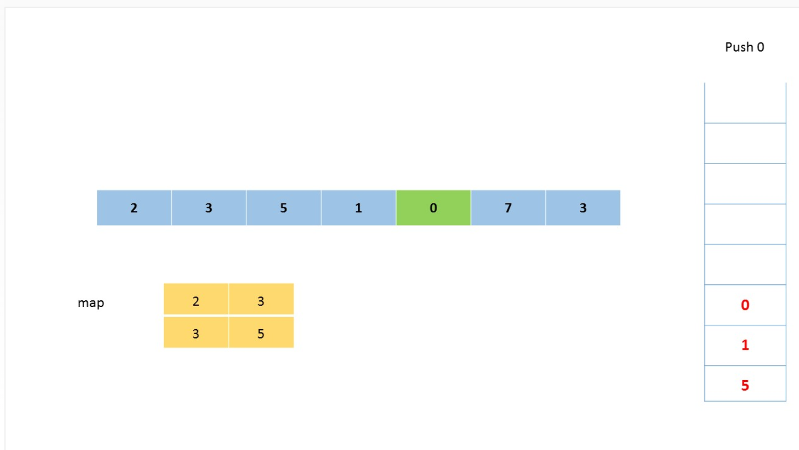

- [496. 下一个更大元素 I](https://leetcode-cn.com/problems/next-greater-element-i/)
> 给定两个没有重复元素的数组 nums1 和 nums2 ，其中nums1 是 nums2 的子集。找到 nums1 中每个元素在 nums2 中的下一个比其大的值。
nums1 中数字 x 的下一个更大元素是指 x 在 nums2 中对应位置的右边的第一个比 x 大的元素。如果不存在，对应位置输出-1。
示例 1:
```shell
输入: nums1 = [4,1,2], nums2 = [1,3,4,2].
输出: [-1,3,-1]
解释:
    对于num1中的数字4，你无法在第二个数组中找到下一个更大的数字，因此输出 -1。
    对于num1中的数字1，第二个数组中数字1右边的下一个较大数字是 3。
    对于num1中的数字2，第二个数组中没有下一个更大的数字，因此输出 -1。
```

解法：参考[官方单调栈解法](https://leetcode-cn.com/problems/next-greater-element-i/solution/xia-yi-ge-geng-da-yuan-su-i-by-leetcode/)

```python3
class Solution:
    def nextGreaterElement(self, nums1: List[int], nums2: List[int]) -> List[int]:
        stack = []
        reg = {}
        # reg记录nums2中每个数下一个更大元素
        # stack维护一个单调递减序列
        for i, v in enumerate(nums2):
            while stack and nums2[stack[-1]] < v:
                # 当前元素v > stack中的元素
                # stack[-1]弹栈，并记stack的下一个更大元素为v
                reg[nums2[stack.pop()]] = v
            stack.append(i)
        # 从reg中检索nums1中的每个元素
        res = []
        for num in nums1:
            if num in reg:
                res.append(reg[num])
            else:
                res.append(-1)
        return res
```
这就是单调队列解决问题的模板。for 循环要从后往前扫描元素，因为我们借助的是栈的结构，倒着入栈，其实是正着出栈。while 循环是把两个“高个”元素之间的元素排除，因为他们的存在没有意义，前面挡着个“更高”的元素，所以他们不可能被作为后续进来的元素的 Next Great Number 了。

这个算法的时间复杂度不是那么直观，如果你看到 for 循环嵌套 while 循环，可能认为这个算法的复杂度也是 O(n^2)，但是实际上这个算法的复杂度只有 O(n)。

分析它的时间复杂度，要从整体来看：总共有 n 个元素，每个元素都被 push 入栈了一次，而最多会被 pop 一次，没有任何冗余操作。所以总的计算规模是和元素规模 n 成正比的，也就是 O(n) 的复杂度。(参考：[单调栈解决 Next Greater Number 一类问题](https://leetcode-cn.com/problems/next-greater-element-i/solution/dan-diao-zhan-jie-jue-next-greater-number-yi-lei-w/))

- [739. 每日温度](https://leetcode-cn.com/problems/daily-temperatures/)
> 根据每日 气温 列表，请重新生成一个列表，对应位置的输入是你需要再等待多久温度才会升高超过该日的天数。如果之后都不会升高，请在该位置用 0 来代替。

> 例如，给定一个列表 temperatures = [73, 74, 75, 71, 69, 72, 76, 73]，你的输出应该是 [1, 1, 4, 2, 1, 1, 0, 0]。

`提示：气温 列表长度的范围是 [1, 30000]。每个气温的值的均为华氏度，都是在 [30, 100] 范围内的整数。`

解法: stack中存储的是元素的索引，不同于`下一个更大的元素 I`直接存储元素，因为那里所有的元素是不同的。所以一般用存储索引更常见！
```python3
class Solution:
    def dailyTemperatures(self, T: List[int]) -> List[int]:
        res = [0 for _ in range(len(T))]
        stack = []
        # 时间复杂度O(N), 空间复杂度O(N)
        for i, v in enumerate(T):
            # stack维护单调递减栈
            while stack and T[stack[-1]] < v:
                # 弹出当前温度坐标，并与下一个更大坐标作差
                idx = stack.pop()
                res[idx] = i - idx
            stack.append(i)
        return res
```
- [503. 下一个更大元素 II](https://leetcode-cn.com/problems/next-greater-element-ii/submissions/)
>给定一个循环数组（最后一个元素的下一个元素是数组的第一个元素），输出每个元素的下一个更大元素。数字 x 的下一个更大的元素是按数组遍历顺序，这个数字之后的第一个比它更大的数，这意味着你应该循环地搜索它的下一个更大的数。如果不存在，则输出 -1。

示例 1:
```shell
输入: [1,2,1]
输出: [2,-1,2]
解释: 第一个 1 的下一个更大的数是 2；
数字 2 找不到下一个更大的数； 
第二个 1 的下一个最大的数需要循环搜索，结果也是 2。
```

解法：模拟nums加倍，循环两倍
```python3
class Solution:
    def nextGreaterElements(self, nums: List[int]) -> List[int]:
        n = len(nums)
        stack = []
        res = [-1 for _ in range(n)]
        # 模拟nums加倍了，故循环2倍
        for i in range(2 * n):
            while stack and nums[stack[-1] % n] < nums[i % n]:
                res[stack.pop() % n] = nums[i % n]
            stack.append(i % n)
        return res
```
