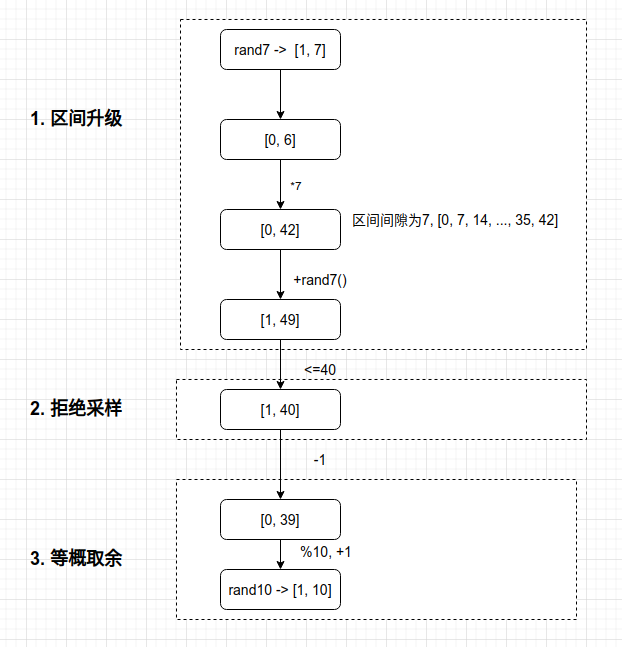

# 水塘抽样
[参考：
[labuladong-随机算法之水塘抽样算法](https://mp.weixin.qq.com/s/DrBFYAZnPBgNNay2wjNU-A)  ]       

我第一次见到这个算法问题是谷歌的一道算法题：给你一个未知长度的链表，请你设计一个算法，只能遍历一次，随机地返回链表中的一个节点。    

这里说的随机是均匀随机（uniform random），也就是说，如果有n个元素，每个元素被选中的概率都是`1/n`，不可以有统计意义上的偏差。      

一般的想法就是，我先遍历一遍链表，得到链表的总长度n，再生成一个`[1,n]`之间的随机数为索引，然后找到索引对应的节点，不就是一个随机的节点了吗？      

但题目说了，只能遍历一次，意味着这种思路不可行。题目还可以再泛化，给一个未知长度的序列，如何在其中随机地选择`k`个元素？想要解决这个问题，就需要著名的水塘抽样算法了。

### 算法实现
**先解决只抽取一个元素的问题**，这个问题的难点在于，随机选择是`「动态」`的，比如说你现在你有 `5` 个元素，你已经随机选取了其中的某个元素`a`作为结果，但是现在再给你一个新元素`b`，你应该留着`a`还是将`b`作为结果呢，以什么逻辑选择`a`和`b`呢，怎么证明你的选择方法在概率上是公平的呢？       

先说结论，**当你遇到第`i`个元素时，应该有`1/i`的概率选择该元素，`1 - 1/i`的概率保持原有的选择。**      

<details>
    <summary>看代码容易理解这个思路： </summary>
    
```java
/* 返回链表中一个随机节点的值 */
int getRandom(ListNode head) {
    Random r = new Random();
    int i = 0, res = 0;
    ListNode p = head;
    // while 循环遍历链表
    while (p != null) {
        // 生成一个 [0, i) 之间的整数
        // 这个整数等于 0 的概率就是 1/i
        if (r.nextInt(++i) == 0) {
            res = p.val;
        }
        p = p.next;
    }
    return res;
}
```
</details>   

同理，如果要随机选择`k`个数，只要在第`i`个元素处以`k/i`的概率选择该元素，
以`1 - k/i`的概率保持原有选择即可。
<details>
    <summary>代码如下:</summary>
    
```java
/* 返回链表中 k 个随机节点的值 */
int[] getRandom(ListNode head, int k) {
    Random r = new Random();
    int[] res = new int[k];
    ListNode p = head;

    // 前 k 个元素先默认选上
    for (int j = 0; j < k && p != null; j++) {
        res[j] = p.val;
        p = p.next;
    }

    int i = k;
    // while 循环遍历链表
    while (p != null) {
        // 生成一个 [0, i) 之间的整数
        int j = r.nextInt(++i);
        // 这个整数小于 k 的概率就是 k/i
        if (j < k) {
            res[j] = p.val;
        }
        p = p.next;
    }
    return res;
}
```
</details>

### 实例题目
- [382. 链表随机节点](https://leetcode-cn.com/problems/linked-list-random-node/submissions/)
>给定一个单链表，随机选择链表的一个节点，并返回相应的节点值。保证每个节点被选的概率一样。         
>
>进阶:       
如果链表十分大且长度未知，如何解决这个问题？你能否使用常数级空间复杂度实现？      

示例：     
```shell
// 初始化一个单链表 [1,2,3].
ListNode head = new ListNode(1);
head.next = new ListNode(2);
head.next.next = new ListNode(3);     
Solution solution = new Solution(head);     
      
// getRandom()方法应随机返回1,2,3中的一个，保证每个元素被返回的概率相等。      
solution.getRandom();
```

<details>
    <summary>解题思路</summary>
    
```python3
# Definition for singly-linked list.
# class ListNode:
#     def __init__(self, x):
#         self.val = x
#         self.next = None

class Solution:

    def __init__(self, head: ListNode):
        """
        @param head The linked list's head.
        Note that the head is guaranteed to be not null, so it contains at least one node.
        """
        self.head = head
        self.random = 0

    def getRandom(self) -> int:
        """
        Returns a random node's value.
        """
        if not self.head:
            return -float('Inf')
        node = self.head
        i = 1
        while node:
            # randint(1, i)的范围为 [1, i]
            if random.randint(1, i) == 1:
                self.random = node.val
            i += 1
            node = node.next
        return self.random
```
</details>


- [398. 随机数索引](https://leetcode-cn.com/problems/random-pick-index/)
>给定一个可能含有重复元素的整数数组，要求随机输出给定的数字的索引。 您可以假设给定的数字一定存在于数组中。        
>
>注意：        
>数组大小可能非常大。 使用太多额外空间的解决方案将不会通过测试。     

示例:
```shell
int[] nums = new int[] {1,2,3,3,3};
Solution solution = new Solution(nums);

// pick(3) 应该返回索引 2,3 或者 4。每个索引的返回概率应该相等。
solution.pick(3);

// pick(1) 应该返回 0。因为只有nums[0]等于1。
solution.pick(1);
```
<details>
    <summary>解题思路</summary>
    
```python3
class Solution:

    def __init__(self, nums: List[int]):
        self.nums = nums
        self.random = 0

    def pick(self, target: int) -> int:
        n = 0
        for i, v in enumerate(self.nums):
            if v == target:
                n += 1
                # randint的范围为 [1, n]
                if random.randint(1, n) == 1:
                    self.random = i 
        return self.random
```
</details>

# randx 转化 randy
### 小转大
- [470. 用 Rand7() 实现 Rand10()](https://leetcode-cn.com/problems/implement-rand10-using-rand7/)
> 已有方法 rand7 可生成 1 到 7 范围内的均匀随机整数，
>试写一个方法 rand10 生成 1 到 10 范围内的均匀随机整数。

看图解题思路：

1). 区间升级

2). 拒绝采样

3). 等概取余



<details>
    <summary>解题思路</summary>
   
```python 
# The rand7() API is already defined for you.
# def rand7():
# @return a random integer in the range 1 to 7

class Solution:
    def rand10(self):
        """
        :rtype: int
        """
        num = (rand7() - 1) * 7 + rand7()
        while num > 40:
            num = (rand7() - 1) * 7 + rand7()
        return (num - 1) % 10 + 1
```
</details>


### 大转小

