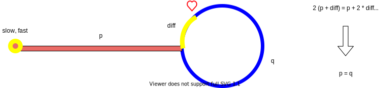

# I. 逆序打印链表
 
- [剑指 Offer 06. 从尾到头打印链表](https://leetcode-cn.com/problems/cong-wei-dao-tou-da-yin-lian-biao-lcof/)
> 输入一个链表的头节点，从尾到头反过来返回每个节点的值（用数组返回）。

<details>
    <summary>解题思路</summary>
    

方法一： 递归
```python
class Solution:
    def reversePrint(self, head: ListNode) -> List[int]:
        f = self.reversePrint
        return f(head.next) + [head.val] if head else []
```
方法二： 迭代
```python
class Solution:
    def reversePrint(self, head: ListNode) -> List[int]:
        ans = []
        while head:
            ans.append(head.val)
            head = head.next
        return ans[::-1]
```
</details>

- [1265. 逆序打印不可变链表](https://leetcode-cn.com/problems/print-immutable-linked-list-in-reverse/)
<details>
    <summary>解题思路</summary>
    
```python
class Solution:
    def printLinkedListInReverse(self, head: 'ImmutableListNode') -> None:
        if head:
            self.printLinkedListInReverse(head.getNext())
            head.printValue()
``` 
</details>

# II. 反转链表
##### 1). 反转整个链表
参考：

[步步拆解：如何递归地反转链表的一部分](https://leetcode-cn.com/problems/reverse-linked-list-ii/solution/bu-bu-chai-jie-ru-he-di-gui-di-fan-zhuan-lian-biao/)

[递归反转链表：如何拆解复杂问题](https://mp.weixin.qq.com/s?__biz=MzAxODQxMDM0Mw==&mid=2247484467&idx=1&sn=beb3ae89993b812eeaa6bbdeda63c494&chksm=9bd7fa3baca0732dc3f9ae9202ecaf5c925b4048514eeca6ac81bc340930a82fc62bb67681fa&mpshare=1&scene=1&srcid=0904Q5ccyLNU2Q1eDDsFV89m&sharer_sharetime=1599228259466&sharer_shareid=166bdf842ef8f7b635591390fb76a3a9#rd)


- [剑指 Offer 24. 反转链表](https://leetcode-cn.com/problems/fan-zhuan-lian-biao-lcof/)
> 定义一个函数，输入一个链表的头节点，反转该链表并输出反转后链表的头节点。

示例:
```shell script
输入: 1->2->3->4->5->NULL
输出: 5->4->3->2->1->NULL
```

<details>
    <summary>解题思路</summary>
    
递归版本：
```python
class Solution:
    def reverseList(self, head: ListNode) -> ListNode:
        if not head or not head.next:
            return head
        last = self.reverseList(head.next)
        head.next.next = head
        head.next = None
        return last
``` 

迭代版本：
```python
class Solution:
    def reverseList(self, head: ListNode) -> ListNode:
        pre, cur = None, head
        while cur:
            # 首尾衔接
            tmp = cur.next
            cur.next = pre
            pre = cur
            cur = tmp
        return pre
```
</details>

##### 2). 翻转前N个链表

反转链表前n个节点和反转整个链表类似
<details>
    <summary>解题思路</summary>
    
迭代版本：
```python
def reverseN(head: ListNode):
	successor = head
	# 找到第n+1个节点
	for _ in range(n):
		successor = successor.next
	# pre指向successor
	pre, cur = successor, head
	while cur != successor:
		tmp = cur.next
		cur.next = pre
		pre = cur
		cur = tmp
	return pre
``` 

递归版本：
```python
successor = None

def reverseN(head, n):
    if n == 1:
        # 记录第 n + 1 个节点
        successor = head.next
        return head
    # 以 head.next 为起点， 反转前 n - 1 个节点
    last = reverseN(head.next, n - 1)
    head.next.next = head
    # 让反转之后的 head 节点和后面的节点连接起来
    head.next = successor
    return last
```
</details>

##### 3). 反转链表的一部分
- [92. 反转链表 II](https://leetcode-cn.com/problems/reverse-linked-list-ii/)

给一个索引区间`[m,n]`（索引从 `1` 开始），仅仅反转区间中的链表元素。

<details>
    <summary>解题思路</summary>
    
递归版本
```python
class Solution:
    successor = None
    def reverseBetween(self, head: ListNode, m: int, n: int) -> ListNode:
        if m == 1:
            return self.reverseN(head, n)
        else:
            head.next = self.reverseBetween(head.next, m - 1, n - 1)
            return head
    
    
    def reverseN(self, head, n):
        global successor
        if n == 1:
            successor = head.next
            return head
        last = self.reverseN(head.next, n - 1)
        head.next.next, head.next = head, successor
        return last
``` 

迭代版本
```python
class Solution:
    def reverseBetween(self, head: ListNode, m: int, n: int) -> ListNode:
        # 因为m可能为1， 头结点也在反转里面，故需要dummy
        dummy = ListNode(-1)
        dummy.next = head
        pre, cur = dummy, head
        for _ in range(1, m):
            pre, cur = cur, cur.next
        # 左边m处断开的两头
        l1, l2 = pre, cur
        for _ in range(m, n + 1):
            tmp = cur.next
            cur.next = pre
            pre = cur
            cur = tmp
        # 右边n处断开的两处
        r1, r2 = pre, cur
        # m-n段反转，m处和n处的节点指向改变
        l1.next, l2.next = r1, r2
        return dummy.next
```
</details>

- [25. K 个一组翻转链表](https://leetcode-cn.com/problems/reverse-nodes-in-k-group/)
> 给你一个链表，每 k 个节点一组进行翻转，请你返回翻转后的链表。          
k 是一个正整数，它的值小于或等于链表的长度。         
如果节点总数不是 k 的整数倍，那么请将最后剩余的节点保持原有顺序。

<details>
    <summary>解题思路</summary>
    
```python
class Solution:
    def reverseKGroup(self, head: ListNode, k: int) -> ListNode:
        dummy = ListNode(-1)
        dummy.next = head
        nxt = dummy
        while nxt:
            nxt = self._reverseK(nxt, k)
        return dummy.next
    
    def _reverseK(self, dummy, k):
        pre, cur, end = dummy, dummy.next, dummy.next
        for _ in range(k):
            if not end:
                return None
            end = end.next
        l1, l2 = pre, cur
        while cur != end:
            tmp = cur.next
            cur.next = pre
            pre = cur
            cur = tmp
        l1.next, l2.next = pre, cur
        return l2
``` 
</details>

- [24. 两两交换链表中的节点](https://leetcode-cn.com/problems/swap-nodes-in-pairs/)
> 给定一个链表，两两交换其中相邻的节点，并返回交换后的链表。

<details>
    <summary>解题思路</summary>
    
递归版本
```python
class Solution:
    def swapPairs(self, head: ListNode) -> ListNode:
        if not head or not head.next:
            return head
        dummy = head.next
        head.next, dummy.next = dummy.next, head
        dummy.next.next = self.swapPairs(head.next)
        return dummy
``` 

迭代版本
```python
class Solution:
    def swapPairs(self, head: ListNode) -> ListNode:
        dummy = ListNode(-1)
        dummy.next = head
        pre, cur = dummy, dummy.next
        while cur and cur.next:
            tmp = cur.next.next
            pre.next = cur.next
            cur.next.next = cur
            cur.next = tmp
            pre, cur = cur, cur.next
        return dummy.next
```

</details>

**总结：**
0). 分段反转中，设左处断点两点为(l1, l2)， 右处断点两点为(r1, r2)；

1). 反转[m, n)区间的链表，递归解法直接从head开始，
无需关心m前的一个节点(l1节点);
迭代解法需要记录m的前一个节点，使得`l1`指向新的`r2`；

# III. 有序链表合并

- [21. 合并两个有序链表](https://leetcode-cn.com/problems/merge-two-sorted-lists/)
> 将两个升序链表合并为一个新的 升序 链表并返回。新链表是通过拼接给定的两个链表的所有节点组成的。 
```shell script
示例：

输入：1->2->4, 1->3->4
输出：1->1->2->3->4->4
```

<details>
    <summary>解题思路</summary>
    
递归解法
```python
class Solution:
    def mergeTwoLists(self, l1: ListNode, l2: ListNode) -> ListNode:
        if not l1: return l2
        if not l2: return l1
        
        res = None
        if l1.val < l2.val:
            res = l1
            res.next = self.mergeTwoLists(l1.next, l2)
        else:
            res = l2
            res.next = self.mergeTwoLists(l1, l2.next)
        return res
``` 
    
迭代解法
```python
class Solution:
    def mergeTwoLists(self, l1: ListNode, l2: ListNode) -> ListNode:
        dummy = ListNode(-1)
        pNode = dummy
        while l1 and l2:
            if l1.val < l2.val:
                pNode.next = l1
                l1 = l1.next
            else:
                pNode.next = l2
                l2 = l2.next
            pNode = pNode.next
        pNode.next = l1 if l1 else l2
        return dummy.next
``` 
</details>

- [23. 合并K个升序链表](https://leetcode-cn.com/problems/merge-k-sorted-lists/)
> 给你一个链表数组，每个链表都已经按升序排列。            
请你将所有链表合并到一个升序链表中，返回合并后的链表。

```shell script
示例 1：

输入：lists = [[1,4,5],[1,3,4],[2,6]]
输出：[1,1,2,3,4,4,5,6]
解释：链表数组如下：
[
  1->4->5,
  1->3->4,
  2->6
]
将它们合并到一个有序链表中得到。
1->1->2->3->4->4->5->6
```

<details>
    <summary>解题思路</summary>
    
解法一： 借助上题两两合并
```python
class Solution:
    def mergeKLists(self, lists: List[ListNode]) -> ListNode:
        rhead = None
        for l in lists:
            rhead = self.__mergeTwoLists(rhead, l)
        return rhead
    
    def __mergeTwoLists(self, head1, head2):
        dummy = ListNode(-1)
        pNode = dummy
        while head1 and head2:
            if head1.val < head2.val:
                pNode.next = head1
                head1 = head1.next
            else:
                pNode.next = head2
                head2 = head2.next
            pNode = pNode.next
        pNode.next = head1 if head1 else head2
        return dummy.next
``` 
    
解法二： 优先级队列
```python
class Solution:
    def mergeKLists(self, lists: List[ListNode]) -> ListNode:
        hp = []
        for i in range(len(lists)):
            if lists[i]:
                heapq.heappush(hp, (lists[i].val, i))
        
        dummy = ListNode(-1)
        node = dummy
        while hp:
            val, i = heapq.heappop(hp)
            node.next = lists[i]
            node = node.next
            lists[i] = lists[i].next
            if lists[i]:
                heapq.heappush(hp, (lists[i].val, i))
        node.next = None
        return dummy.next
``` 
</details>

# IV.快慢指针
- [141. 环形链表](https://leetcode-cn.com/problems/linked-list-cycle/)
>  给定一个链表，判断链表中是否有环。            
为了表示给定链表中的环，我们使用整数 pos 来表示链表尾连接到链表中的位置（索引从 0 开始）。 如果 pos 是 -1，则在该链表中没有环。

<details>
    <summary>解题思路</summary>
    
```python
class Solution:
    def hasCycle(self, head: ListNode) -> bool:
        slow, fast = head, head
        while slow and slow.next and fast and fast.next:
            slow, fast = slow.next, fast.next.next
            if slow == fast:
                return True
        return False
``` 
</details>

- [142. 环形链表 II](https://leetcode-cn.com/problems/linked-list-cycle-ii/)
> 给定一个链表，返回链表开始入环的第一个节点。 如果链表无环，则返回 null。       
为了表示给定链表中的环，我们使用整数 pos 来表示链表尾连接到链表中的位置（索引从 0 开始）。 如果 pos 是 -1，则在该链表中没有环。

<details>
    <summary>解题思路</summary>
    



如果快慢指针`slow`, `fast`同时出发，但`slow`速度为`1`, `fast`速度为`2`, 
并在`心`处相遇, 则由公式推导, 

必然存在 **`p = q`**, 所以找到相交节点分为两步：

1). 快慢指针找到相交节点，如果没有则直接返回`-1`；

2). `slow`从头开始出发, 此时`slow`和`fast`同时出发, 速度均为`1`, 相遇到的节点即为相交节点.

```python
class Solution:
    def detectCycle(self, head: ListNode) -> ListNode:
        if not head or not head.next:
            return None
        slow, fast = head.next, head.next.next
        while slow != fast:
            if fast and fast.next:
                slow, fast = slow.next, fast.next.next
            else:
                return None
        slow = head
        while slow != fast:
            slow, fast = slow.next, fast.next
        return slow
``` 
</details>

# V. 长短指针
- [剑指 Offer 22. 链表中倒数第k个节点](https://leetcode-cn.com/problems/lian-biao-zhong-dao-shu-di-kge-jie-dian-lcof/)
> 输入一个链表，输出该链表中倒数第k个节点。为了符合大多数人的习惯，
>本题从1开始计数，即链表的尾节点是倒数第1个节点。
>例如，一个链表有6个节点，从头节点开始，
>它们的值依次是1、2、3、4、5、6。
>这个链表的倒数第3个节点是值为4的节点。

<details>
    <summary>解题思路</summary>
    
```python
class Solution:
    def getKthFromEnd(self, head: ListNode, k: int) -> ListNode:
        front, behind = head, head
        while front and k:
            front = front.next
            k -= 1
        # 检查case: k大于链表的长度
        if k < 0 or k > 0 and not front:
            return None
        while front:
            front, behind = front.next, behind.next
        return behind
``` 
</details>

# VI. 链表排序
- [148. 排序链表](https://leetcode-cn.com/problems/sort-list/)
> 给你链表的头结点 head ，请将其按 升序 排列并返回 排序后的链表 。     
在 O(n log n) 时间复杂度和常数级空间复杂度下，对链表进行排序.


<details>
    <summary>解法一:递归－Ｏ(n)空间复杂度</summary>
    
```python
class Solution:
    def sortList(self, head: ListNode) -> ListNode:
        if not head or not head.next:
            return head
        # 找到中点
        slow, fast = head, head.next
        while fast and fast.next:
            slow, fast = slow.next, fast.next.next
        mid, slow.next = slow.next, None
        left = self.sortList(head)          # 完成左边排序,并返回左子链头结点
        right = self.sortList(mid)          # 完成右边排序
        dummy = node = ListNode(-1)
        # 合并两个有序链表-套路模板
        while left and right:
            if left.val < right.val:
                node.next = left
                left = left.next
            else:
                node.next = right
                right = right.next
            node = node.next
        node.next = left if left else right
        return dummy.next
```
</details>


<details>
    <summary>解法二：迭代－Ｏ(1)空间复杂度</summary>
    
```python
class Solution:
    def sortList(self, head: ListNode) -> ListNode:
        # 第一步：　链表长度
        node = head
        length = 0
        while node:
            node = node.next
            length += 1
        
        dummy = ListNode(-1)
        dummy.next = head
        intv = 1
        # 第二步: 一共log(length)个周期(迭代轮询),每个周期都是轮询整个链表
        while intv < length:
            pre, h = dummy, dummy.next
            # 第三步: 在当前长度为intv的轮询周期
            while h:
                h1, i = h, intv                             # h1, h2分别是待比较的左右子链的头结点
                while h and i:
                    h = h.next
                    i -= 1
                if i:                                       # h=None, i>0, 说明只有一个子链, 右子链为空
                    break
                h2, i = h, intv
                while h and i:
                    h = h.next
                    i -= 1
                l1, l2 = intv, intv - i                     # 左子链为2的整数次幂(比如2^k), 右边则比2^k小一点,小i
                while l1 and l2:                            # 合并两个有序链表
                    if h1.val < h2.val:
                        pre.next = h1
                        h1 = h1.next
                        l1 -= 1
                    else:
                        pre.next = h2
                        h2 = h2.next
                        l2 -= 1
                    pre = pre.next
                pre.next = h1 if l1 else h2
                while l1 > 0 or l2 > 0:                     # h1或者h2还有剩下的部分,pre不在剩下部分的尾部
                    pre = pre.next                          # ,需要移动到尾部
                    l1, l2 = l1 - 1, l2 - 1                 # l1, l2同时减少,其中有一个必然为负,但是它没有意义,所以无影响
                pre.next = h                                # 当前轮次合并完成, 接着开始后面的一对左右子链
            intv <<= 1                                      # 下一个子链的最大长度加倍

        return dummy.next
```
</details>
参考: 

[Sort List（归并排序链表)](https://leetcode-cn.com/problems/sort-list/solution/sort-list-gui-bing-pai-xu-lian-biao-by-jyd/)


- 技巧:
找链表中点，快慢指针的起始是`head`和`head.next`，　而不是都是`head`
```python
slow, fast = head, head.next
while fast and fast.next:
    fast, slow = fast.next.next, slow.next
mid, slow.next = slow.next, None
```

# VII. 链表去重
- [83. 删除排序链表中的重复元素](https://leetcode-cn.com/problems/remove-duplicates-from-sorted-list/)
> 给定一个排序链表，删除所有重复的元素，使得每个元素只出现一次。

<details>
    <summary>解法</summary>
    
```python
class Solution:
    def deleteDuplicates(self, head: ListNode) -> ListNode:
        if not head or not head.next: return head
        pre, pNode = head, head
        while pNode:
            if pre.val != pNode.val:
                pre.next = pNode
                pre = pNode
            pNode = pNode.next
        pre.next = pNode
        return head
```
</details>


- [82. 删除排序链表中的重复元素 II](https://leetcode-cn.com/problems/remove-duplicates-from-sorted-list-ii/)
> 给定一个排序链表，删除所有含有重复数字的节点，只保留原始链表中 没有重复出现 的数字。

<details>
    <summary>解法</summary>
    
```python
# 解法一:递归
class Solution(object):
    def deleteDuplicates(self, head):
        """
        :type head: ListNode
        :rtype: ListNode
        """
        if not head: return None
        if head.next and head.val == head.next.val:
            while head.next and head.val == head.next.val:
                head = head.next
            return self.deleteDuplicates(head.next)
        else:
            head.next = self.deleteDuplicates(head.next)
        return head

＃　解法二：　迭代
class Solution(object):
    def deleteDuplicates(self, head):
        """
        :type head: ListNode
        :rtype: ListNode
        """
        dummy = ListNode(-1)
        dummy.next = head
        slow, fast = dummy, dummy.next
        while fast:
            if fast.next and fast.val == fast.next.val:
                tmp = fast.val
                while fast and fast.val == tmp:
                    fast = fast.next
            else:
                slow.next = fast
                slow = slow.next
                fast = fast.next
        slow.next = fast
        return dummy.next
```
</details>


# VIII. 其他
- [160. 相交链表](https://leetcode-cn.com/problems/intersection-of-two-linked-lists/)
> 编写一个程序，找到两个单链表相交的起始节点。

<details>
    <summary>解题思路</summary>
    
```python
# 解法一：　先计算出两个链表的长度，然后长的先走diff步(diff)为两者长度之差
#         再一起走，遇到相等且不为空，即是相交的节点。

# 解法二：
class Solution(object):
    def getIntersectionNode(self, headA, headB):
        """
        :type head1, head1: ListNode
        :rtype: ListNode
        """
        nodeA, nodeB = headA, headB
        while True:
            if nodeA == nodeB:
                return nodeA
            nodeA = nodeA.next if nodeA else headB
            nodeB = nodeB.next if nodeB else headA
``` 

</details>
